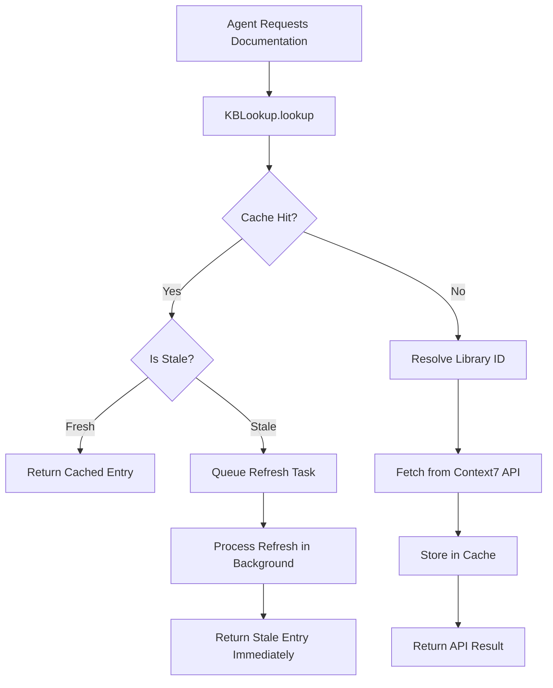

# Context7 Dynamic Cache Guide

**Date:** January 2025  
**Status:** ✅ **ACTIVE** - Dynamic on-demand caching system

---

## Overview

TappsCodingAgents uses a **fully dynamic, on-demand caching system** for Context7 documentation. Unlike static pre-population approaches, this system:

- ✅ Fetches documentation from Context7 API **in real-time** when needed
- ✅ **Automatically caches** entries after fetching
- ✅ **Detects staleness** during lookup
- ✅ **Refreshes stale entries** in background without blocking requests
- ✅ **Never ships Context7 data** - all documentation comes from API
- ✅ **Pre-loads critical libraries** during init (staleness-aware)

---

## How It Works

### Dynamic On-Demand Caching Flow



### Key Components

1. **KBLookup** (`tapps_agents/context7/lookup.py`)
   - Performs KB-first lookup with staleness checking
   - Queues refresh tasks for stale entries
   - Processes refresh queue in background

2. **StalenessPolicyManager** (`tapps_agents/context7/staleness_policies.py`)
   - Defines staleness policies by library type
   - Stable libraries: 30 days
   - Active libraries: 14 days
   - Critical libraries: 7 days

3. **RefreshQueue** (`tapps_agents/context7/refresh_queue.py`)
   - Manages refresh tasks with priority
   - Processes tasks in background
   - Retries failed refreshes

4. **CacheWarmer** (`tapps_agents/context7/cache_warming.py`)
   - Used during init for pre-loading
   - Checks staleness before warming
   - Skips fresh entries

---

## Staleness Detection

### Staleness Policies

The system uses library-specific staleness policies:

| Library Type | Max Age | Examples |
|-------------|---------|----------|
| **Stable** | 30 days | pytest, fastapi, react |
| **Active** | 14 days | Testing tools, dev tools |
| **Critical** | 7 days | Security libraries, auth |

### Automatic Detection

Library type is inferred from name patterns:
- **Critical**: Contains "security", "auth", "jwt", "oauth", "encrypt"
- **Active**: Contains "test", "spec", "mock", "stub"
- **Stable**: Default for all other libraries

### During Lookup

When a cached entry is found:
1. Check if entry is stale using `StalenessPolicyManager`
2. If **fresh**: Return immediately
3. If **stale**: 
   - Queue refresh task (non-blocking)
   - Process refresh in background
   - Return stale entry immediately (don't block)

---

## Background Refresh Processing

### Refresh Queue

Stale entries are queued for refresh with:
- **Priority**: Based on staleness severity (1-10)
- **Reason**: "staleness"
- **Scheduled**: Immediate or scheduled for later

### Background Processing

Refresh queue is processed:
- **During lookup**: 1 item per lookup (non-blocking)
- **Via command**: `*context7-kb-refresh` processes all stale entries
- **Automatic**: Background tasks process queue asynchronously

### Priority System

| Staleness | Priority | Description |
|-----------|----------|-------------|
| Very stale (>7 days past max age) | 9 | Urgent refresh needed |
| Stale (past max age) | 7 | Refresh needed |
| Consider refresh (<7 days until stale) | 3 | Optional refresh |

---

## Init Pre-Loading

### What Gets Pre-Loaded

During `tapps-agents init`, the system pre-loads:

1. **Project Dependencies**
   - Detected from `requirements.txt`, `pyproject.toml`, `package.json`
   - Common topics for each library

2. **Built-in Expert Libraries** (37 libraries)
   - Security Expert: bandit, safety, cryptography, pyjwt, bcrypt
   - Performance Expert: cprofile, memory-profiler, line-profiler, cachetools
   - Testing Expert: pytest, pytest-cov, pytest-mock, pytest-asyncio, coverage
   - Code Quality Expert: ruff, mypy, pylint, black, radon
   - Database Expert: sqlalchemy, pymongo, psycopg2, redis, sqlite3
   - API Design Expert: fastapi, flask, django, starlette, httpx, requests, aiohttp
   - Observability Expert: prometheus-client, opentelemetry, structlog, sentry-sdk
   - Cloud Infrastructure Expert: boto3, kubernetes, docker
   - Data Processing: pandas, numpy, pydantic

### Pre-Loading Behavior

- **Staleness-aware**: Skips entries that are already cached and fresh
- **Non-blocking**: Runs in background, doesn't delay init
- **Graceful failure**: Continues if API unavailable
- **Rate-limited**: Respects API quotas

---

## Cache Validation

### Validation Command

Use `*context7-kb-validate-cache` to check cache coverage:

```python
{
    "success": True,
    "total_required": 37,
    "cached_libraries": 7,
    "missing_libraries": [...],
    "stale_libraries": [...],
    "missing_topics": {...},
    "coverage_percentage": 18.9,
    "suggestions": [
        "Cache missing libraries: httpx, aiohttp, pytest-asyncio, ...",
        "Refresh stale entries: 5 entries need refresh"
    ]
}
```

### What It Checks

1. **Required Libraries**: Compares cached libraries against `get_builtin_expert_libraries()`
2. **Stale Entries**: Identifies entries that need refresh
3. **Missing Topics**: Lists missing topics for cached libraries
4. **Coverage**: Calculates percentage of required libraries cached

---

## Usage Examples

### Normal Operation

Agents request documentation automatically:

```python
# Agent requests documentation
result = await context7_commands.cmd_docs("pytest", topic="fixtures")

# System:
# 1. Checks cache
# 2. If found and fresh: Returns immediately
# 3. If found and stale: Queues refresh, returns stale entry
# 4. If not found: Fetches from API, caches, returns
```

### Manual Refresh

Refresh stale entries manually:

```python
# Refresh all stale entries
await context7_commands.cmd_refresh()

# Refresh specific library
await context7_commands.cmd_refresh(library="pytest")

# Refresh specific topic
await context7_commands.cmd_refresh(library="pytest", topic="fixtures")
```

### Cache Validation

Check cache coverage:

```python
# Validate cache
result = await context7_commands.cmd_validate_cache()

print(f"Coverage: {result['coverage_percentage']}%")
print(f"Missing: {len(result['missing_libraries'])} libraries")
print(f"Stale: {len(result['stale_libraries'])} entries")
```

---

## Benefits

### Dynamic Growth

- Cache builds automatically as agents request documentation
- No manual pre-population required
- Cache grows organically based on actual usage

### Always Fresh

- Staleness detection ensures data freshness
- Background refresh doesn't block requests
- Users get immediate responses with fresh data on next request

### Efficient

- Skips fresh entries during pre-loading
- Only refreshes when needed
- Respects API rate limits

### No Data Shipping

- No Context7 data shipped with TappsCodingAgents
- All documentation comes from Context7 API
- Always up-to-date with latest documentation

---

## Troubleshooting

### Cache Not Growing

**Problem**: Cache doesn't seem to be growing

**Solutions**:
1. Check Context7 API key is configured: `*context7-kb-status`
2. Verify API is accessible: `*context7-kb-health`
3. Check for API errors in logs
4. Run validation: `*context7-kb-validate-cache`

### Stale Entries Not Refreshing

**Problem**: Stale entries aren't being refreshed

**Solutions**:
1. Check refresh queue: `*context7-kb-refresh` (shows queue status)
2. Manually trigger refresh: `*context7-kb-refresh`
3. Check staleness policies: Verify library type detection
4. Check API availability: `*context7-kb-health`

### Low Cache Coverage

**Problem**: Cache coverage is low

**Solutions**:
1. Run init pre-loading: `tapps-agents init` (pre-loads expert libraries)
2. Use agents: Cache grows as agents request documentation
3. Manual population: `*context7-kb-populate <libraries>`
4. Check validation: `*context7-kb-validate-cache` for suggestions

### API Rate Limits

**Problem**: Hitting API rate limits

**Solutions**:
1. Background refresh is rate-limited automatically
2. Pre-loading respects quotas
3. Consider upgrading Context7 plan
4. Use cache validation to identify critical libraries

---

## Configuration

### Staleness Policies

Staleness policies are configured in `tapps_agents/context7/staleness_policies.py`:

```python
# Default policies
StalenessPolicy(max_age_days=30, library_type="stable")  # Default
StalenessPolicy(max_age_days=14, library_type="active")  # Testing tools
StalenessPolicy(max_age_days=7, library_type="critical")  # Security
```

### Cache Structure

Cache is stored in `.tapps-agents/context7/kb/`:
- `cache/` - Cached documentation files
- `index.json` - Cache index
- `refresh_queue.yaml` - Refresh queue
- `metadata/` - Cache metadata

---

## Related Documentation

- **Implementation Plan**: `docs/implementation/CONTEXT7_CACHE_IMPROVEMENT_PLAN.md`
- **API Key Management**: `docs/CONTEXT7_API_KEY_MANAGEMENT.md`
- **Cache Optimization**: `docs/CONTEXT7_CACHE_OPTIMIZATION.md`
- **Commands Reference**: See `tapps_agents/context7/commands.py` help

---

## Summary

TappsCodingAgents uses a **dynamic, on-demand caching system** that:

- ✅ Fetches documentation from Context7 API in real-time
- ✅ Automatically caches entries after fetching
- ✅ Detects and refreshes stale entries in background
- ✅ Pre-loads critical libraries during init
- ✅ Never ships Context7 data with the framework

The system ensures agents always have access to up-to-date documentation while maintaining optimal performance through intelligent caching and staleness management.

