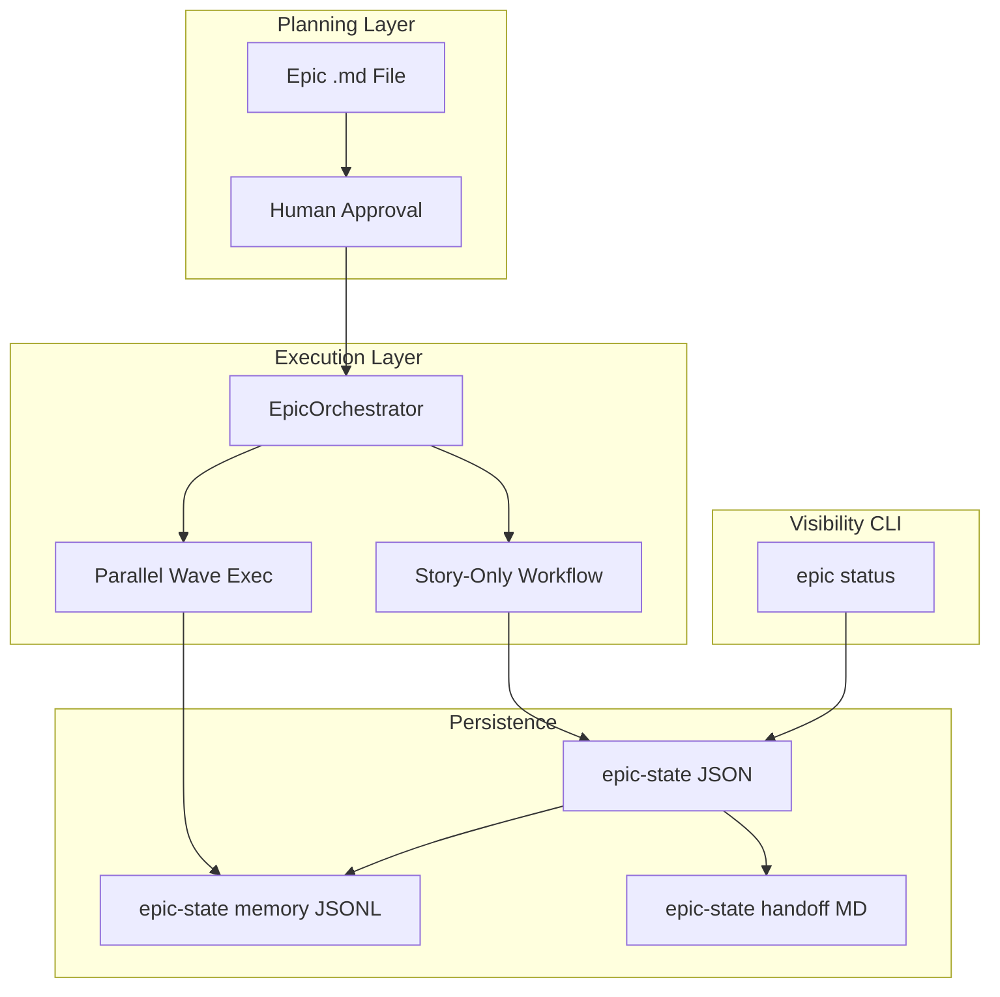

# Epic and Workflow Enhancement Design Plan

## Executive Summary

This plan improves Epic execution (visibility, resume, status CLI), context wiring, story-only workflow, parallel execution, Epic memory, session handoff, workflow auto-selection, **Claude Code integration**, and **expert system LLM visibility**. It addresses gaps in progress persistence, workflow routing, intent parsing, multi-agent execution, and expert discoverability.

**Benefits**: Epics become easier to run, track, and resume; agents get proper spec context; faster execution via story-only mode and parallel waves; better workflow selection from prompts. **Phase 7 (Claude Code)** adds: zero-config Claude Code setup via `.claude/settings.json` (Phase 7.8), isolated context per story (subagents), true parallel execution (Agent Teams), persistent cross-session learning (subagent memory), CI/CD automation (Agent SDK), and cost-optimized model routing (haiku/sonnet/opus).

**Phases 0–6** work without Claude Code. **Phase 7** is optional and additive — enhances when Claude Code CLI is available. **Phase 8** makes the expert system visible and consultable by the LLM — critical for projects using tapps-agents.

**Current Status (2026-02-06)**: Init Autofill infrastructure (Phases 1-3 of a parallel initiative) is **complete**: ConfigValidator, TechStackDetector, Context7CacheManager, ExpertGenerator, ExpertKnowledgeLinker, RAG sync, and ProjectOverviewGenerator are built and tested (130+ tests, 82%+ coverage). These provide foundation for Phases 6 and 8. Core plan phases (0-5) are **not started** — Epic progress persistence, story-only workflow, parallel execution, and auto-selection remain the primary work.

---

## Design Principles (From Discussion)

- **Epic = planning layer**: Human approves, edits, prioritizes stories before coding
- **Story = bounded context**: Each story = one workflow run with limited scope
- **Simple Mode for execution**: implement → review → test (no enhance/plan/architect when story is pre-approved)
- **CLI-only visibility**: No GUI; use `epic status` and persisted state files
- **Keep existing stack**: Beads + task-specs + Epic .md; no Linear integration
- **Local execution only**: Parallel execution via internal wave-based parallelism (Phase 3) or Claude Code Agent Teams (Phase 7); no Cursor cloud background agents
- **Platform-adaptive**: Phases 0–6 work in any environment (Cursor, Claude Code CLI, generic). Phase 7 enhances when Claude Code CLI is available (subagents, Agent Teams, persistent memory, Agent SDK)

### Best Practices (Design Constraints)

The design follows these practices:

- **Epics as containers**: Organize related stories; break work into smaller pieces to reduce risk and improve feedback loops
- **Topological ordering**: Execution order respects dependencies; topological sort is the standard approach
- **JSON-serializable state**: State must be JSON-serializable for persistence and resume
- **Checkpoints at phase boundaries**: Capture state at end of each major phase (e.g. after each story)
- **Wavefront pattern**: Tasks with no mutual dependencies form a wave and run in parallel; next wave starts when its dependencies complete
- **Bounded concurrency**: Limit parallel execution (e.g. `max_parallel_stories: 3`) to avoid resource exhaustion
- **Context filtering for handoffs**: Define what data the next agent/session needs; avoid passing entire history when not needed

---

## Current State

| Component | Location | Behavior |
|-----------|----------|----------|
| Epic orchestrator | [tapps_agents/epic/orchestrator.py](../tapps_agents/epic/orchestrator.py) | Runs stories sequentially; each story runs enhance→plan→implement→review→test; report saved only at end |
| Story workflow | `_create_story_workflow()` (lines 307-393) | Full planning pipeline per story; no "story-only" mode |
| Epic report | `save_report()` | Writes `epic-{N}-report.json` to epic dir; only when Epic completes |
| Workflow state | `.tapps-agents/workflow-state/` | Per-workflow; no Epic-level persistence |
| ArtifactContextBuilder | [tapps_agents/core/artifact_context_builder.py](../tapps_agents/core/artifact_context_builder.py) | Token budgeting for spec/stories/architecture; used within Build orchestrator |

**Gaps**: No Epic progress persistence during execution; no `epic status` command; no story-only workflow; stories run sequentially; no Epic memory for cross-story context; no session handoff. **Workflow auto-selection**: explicit *build/*fix/*full parsing missing; unified intent taxonomy; validate wiring partial.

---

## Implementation Status (As of 2026-02-06)

Other agents have implemented an **Init Autofill** system in parallel with this plan's design. These modules provide infrastructure that several plan phases can leverage. The table below tracks what is built vs. what remains.

### Already Built (Init Autofill Phases 1-3 + RAG)

| Module | File | What It Does | Plan Phase Overlap | Status |
|--------|------|--------------|--------------------|--------|
| **ConfigValidator** | `tapps_agents/core/validators/config_validator.py` | Validates experts.yaml, domains.md, tech-stack.yaml, config.yaml; auto-fix support | Phase 6 (init validation) | Complete (34 tests, 82% cov) |
| **TechStackDetector** | `tapps_agents/core/detectors/tech_stack_detector.py` | Detects languages, frameworks, deps from project files; generates tech-stack.yaml | Phase 6.1 (init) | Complete (28 tests, 84% cov) |
| **Context7CacheManager** | `tapps_agents/core/context7/cache_manager.py` | Async concurrent cache population from tech-stack.yaml; checks cached libraries | Phase 8.5 (expert cached) | Complete (36 tests, 93% cov) |
| **ExpertGenerator** | `tapps_agents/core/generators/expert_generator.py` | Auto-generates expert configs from knowledge base `.md` files | Phase 8 (expert infrastructure) | Complete (32 tests, 83% cov) |
| **ExpertKnowledgeLinker** | `tapps_agents/core/linkers/expert_knowledge_linker.py` | Links knowledge files to experts; identifies orphan files | Phase 8 (expert infrastructure) | Complete |
| **init_autofill** | `tapps_agents/core/init_autofill.py` | Orchestrates Phases 1-3.1 (validate, detect, cache, generate) | Phase 6.1 (init) | Complete |
| **ProjectOverviewGenerator** | `tapps_agents/core/generators/project_overview_generator.py` | Generates project overview with architecture detection + Mermaid | New (not in plan) | Complete |
| **RagSynchronizer** | `tapps_agents/core/sync/rag_synchronizer.py` | Syncs knowledge files when code changes; detects stale imports | New (not in plan) | Mostly complete (rename detect placeholder) |
| **RAG CLI** | `tapps_agents/cli/commands/rag.py` | `tapps-agents rag sync`, `generate-overview`, `detect-architecture` | New (not in plan) | Complete |
| **setup-experts CLI** | `tapps_agents/cli/commands/top_level.py` (L2629-2657) | `setup-experts init/add/remove/list` via ExpertSetupWizard | Phase 8.3 (partial) | Complete |
| **ExpertConfig** | `tapps_agents/core/config.py` (ExpertConfig class) | Agent-specific confidence thresholds, RAG params, weights | Phase 8 (expert infrastructure) | Complete |
| **Progress Display** | `tapps_agents/core/progress_display.py` | Phase-grid format for workflow summaries | New (not in plan) | Complete |

### Integration with init_project.py

- `init_project.py` imports `detect_tech_stack_enhanced` from `init_autofill.py`
- Enhanced tech stack detection active when `use_enhanced_detection=True` (default)
- Expert auto-generation via `generate_experts_from_knowledge()` when `auto_experts=True`
- Phase 3.2 (ExpertKnowledgeLinker) exists but is **not yet integrated** into init

### NOT Yet Built (Core Plan Phases)

| Plan Phase | Description | Status |
|------------|-------------|--------|
| **Phase 0** | Context and Variable Wiring (ImplementerHandler, Epic story spec) | Not started |
| **Phase 1** | Epic Progress Persistence + Status CLI + Cleanup | Not started |
| **Phase 2** | Story-Only Workflow + Approval + Beads + Framework Detection | Not started |
| **Phase 3** | Parallel Story Execution (asyncio waves) | Not started |
| **Phase 4** | Epic Memory + Session Handoff | Not started |
| **Phase 5** | Workflow Auto-Selection (unified taxonomy, explicit parsing) | Not started |
| **Phase 6** | Documentation and Project Setup (init, rules, docs) | Partially done (init_autofill) |
| **Phase 7** | Claude Code Integration (settings, subagents, teams, SDK) | Not started |
| **Phase 8** | Expert System LLM Visibility (rule, @expert skill, CLI) | Infrastructure exists; LLM-facing parts not started |

### Config Sections NOT Yet Added

| Config Section | Plan Phase | Notes |
|----------------|------------|-------|
| `epic.*` (story_workflow_mode, max_parallel_stories) | Phase 1-3 | No `epic` section in config.py yet |
| `claude_code.*` (auto_configure, enable_subagents, model_routing) | Phase 7 | No `claude_code` section in config.py yet |
| `simple_mode.auto_select_workflow` | Phase 5 | Not added yet |

---

## Agent and Context Benefits Audit

TappsCodingAgents provides **experts** (ExpertSupportMixin), **Context7** (library documentation), and **adaptive learning** to agents. When agents run, they get these benefits. The issue is **input context**—what spec/state we pass into each step.

### Workflow Path Comparison

| Aspect | Build Orchestrator (*build) | Epic / WorkflowExecutor |
|--------|-----------------------------|-------------------------|
| **Execution** | Direct agent calls via MultiAgentOrchestrator | Handlers + WorkflowExecutor |
| **Implementer context** | `_enrich_implementer_context()`: WorkflowDocumentationManager + ArtifactContextBuilder (spec, user_stories, architecture, api_design, ~4000 token budget) | ImplementerHandler reads `state.variables`: user_prompt, enhanced_prompt, architecture |
| **Epic sets** | N/A | description, story_description |
| **ImplementerHandler reads** | N/A | user_prompt, enhanced_prompt, architecture (not description/story_description) |
| **Architect/Designer steps** | Yes (steps 3–4) | No (Epic workflow: enhance→plan→implement) |
| **Planner → Implementer** | Via WorkflowDocumentationReader (step2-user-stories) | No output contract; ImplementerHandler does not read planner_result |
| **Token budgeting** | ArtifactContextBuilder | None |

### Gaps Identified

1. **Variable naming**: Epic sets `description` and `story_description`; ImplementerHandler expects `user_prompt`. Implementer gets `enhanced_prompt` from EnhancerHandler, but for **story-only** (no enhance), neither is set from Epic's story spec.

2. **Story-only workflow**: implement → review → test. No enhance, no plan. The spec for implementer = story description + acceptance criteria. ImplementerHandler does **not** read `description` or `story_description` when building the spec.

3. **Epic full workflow (enhance→plan→implement)**: Implementer gets `enhanced_prompt` from EnhancerHandler. It does **not** get planner output (user_stories, acceptance criteria). Output contracts have Planner→Architect, Planner→Designer, but no Planner→Implementer.

4. **No ArtifactContextBuilder for Epic**: Epic/WorkflowExecutor path does not use token-budgeted artifact injection. When Epic uses full workflow (enhance+plan), planner output could improve implementer context.

### Agent Capabilities (unchanged)

Agents (Implementer, Reviewer, Architect, Designer, Tester, Ops, etc.) use ExpertSupportMixin and Context7 when invoked. The problem is not agent capabilities but **input context wiring** for Epic and story-only flows.

---

## Phase 0: Context and Variable Wiring (Pre-requisite)

**Goal**: Ensure Epic and story-only flows pass the right spec/context to each agent so they receive full tapps-agents benefits (experts, Context7, adaptive learning).

### 0.1 ImplementerHandler Variable Alignment

**Problem**: Epic sets `description` and `story_description`; ImplementerHandler reads `user_prompt`, `enhanced_prompt`, `architecture`. For story-only, implementer gets no spec.

**Changes** in [tapps_agents/workflow/agent_handlers/implementer_handler.py](../tapps_agents/workflow/agent_handlers/implementer_handler.py):

- When building spec for brownfield (new or existing file), fall back to `description` or `story_description` when `user_prompt` and `enhanced_prompt` are empty.
- Order: `user_prompt` → `enhanced_prompt` → `description` → `story_description` (first non-empty wins for base spec).

### 0.2 Epic Story Spec for Story-Only Workflow

**Problem**: Story-only (implement → review → test) has no enhance/plan. The sole spec is story title + description + acceptance criteria.

**Changes**:

- Epic orchestrator: When using story-only workflow, set `state.variables["description"]` = story title + description; set `state.variables["story_description"]` = description; set `state.variables["acceptance_criteria"]` = acceptance criteria (if available from Epic parser).
- ImplementerHandler: Include `acceptance_criteria` in spec when building from Epic story context (Phase 0.1 fallback).

### 0.3 Optional: Planner → Implementer for Full Epic Workflow

When Epic uses full workflow (enhance → plan → implement), consider:

- Add output contract or state wiring: Planner → Implementer (user_stories, acceptance criteria).
- Or: Use ArtifactContextBuilder-style token-budgeted context when Epic workflow includes plan step (larger change; defer to post-Phase 2 if needed).

**Implementation order**: Phase 0.1 and 0.2 **before** Phase 2.1 (story-only workflow). Phase 0.3 is optional and can follow Phase 2.

---

## Phase 1: Visibility (Epic Progress + Status CLI)

### 1.1 Epic Progress Persistence

**Goal**: Persist story-level progress after each story so Epic can resume and status is queryable.

**Storage**: `.tapps-agents/epic-state/{epic_id}.json` (or `{epic_id}-{run_id}.json` for concurrent runs)

**Schema** (draft):

```json
{
  "schema_version": 1,
  "epic_id": "epic-51",
  "epic_content_checksum": "sha256:...",
  "epic_path": "docs/prd/epic-51.md",
  "epic_title": "YAML Automation Quality Enhancement",
  "started_at": "ISO8601",
  "updated_at": "ISO8601",
  "stories": [
    {
      "story_id": "51.1",
      "status": "done",
      "completed_at": "ISO8601",
      "artifacts": ["path/to/file.py"],
      "quality_scores": {"overall": 78},
      "workflow_id": "optional-for-mid-story-resume",
      "retry_count": 0
    }
  ],
  "execution_order": ["51.1", "51.2", "51.3"]
}
```

**State Concurrency Strategy**:

- **Default (Phase 1)**: Use `epic_id` + `run_id` (timestamp) in state path when `--run-id` or concurrent runs are possible. Primary state file: `{epic_id}.json`; concurrent run uses `{epic_id}-{run_id}.json`.
- **Fallback**: Use file locking (`fcntl` on Unix, `msvcrt` on Windows) when writing to prevent concurrent writers on the same file. Implement locking only if run_id approach proves insufficient (e.g. single-file requirement).
- **Implementation order**: Start with run_id for multiple runs; add file locking in a follow-up if overwrite races are observed.

**Resume**: On load, if `epic_content_checksum` differs from current Epic .md, warn or require re-parse to avoid stale state.

**Changes**:

- In [tapps_agents/epic/orchestrator.py](../tapps_agents/epic/orchestrator.py): After each `_execute_story()` completes (or fails), call `_persist_epic_state()`.
- On `load_epic()`: Load existing state from `.tapps-agents/epic-state/` if present; skip stories already `done` when resuming.
- Add `EpicStateManager` (new module under `tapps_agents/epic/`) for load/save/merge logic.

### 1.2 Epic Status CLI

**Commands**:

```bash
tapps-agents epic status [epic_path]
tapps-agents epic status --all
```

**Behavior**:

- `epic status <path>`: Parse epic, load state if exists; print story table (id, title, status, updated_at) and completion %.
- `epic status --all`: List Epics with persisted state; show completion % for each.

**Implementation**:

- Add `epic` subparser in [tapps_agents/cli/parsers/top_level.py](../tapps_agents/cli/parsers/top_level.py) with `status` subcommand.
- Add handler in `tapps_agents/cli/commands/` (new or extend `simple_mode.py` if epic is under simple-mode).
- Use `EpicStateManager` and `EpicParser` for data.

### 1.3 Epic State Cleanup

**Goal**: Prune or archive old epic-state files to free disk space and reduce clutter.

**Command**:

```bash
tapps-agents cleanup epic-state [--retention-days 30] [--remove-completed] [--archive] [--dry-run]
```

**Parameters**:

| Parameter | Default | Description |
|-----------|---------|-------------|
| `--retention-days` | 30 | Remove/archive state files older than N days |
| `--remove-completed` | false | Only remove state for Epics with status `completed` |
| `--archive` | from config | Move to `.tapps-agents/archives/epic-state/` instead of delete |
| `--dry-run` | false | Preview what would be removed without making changes |

**Behavior**:

- Scan `.tapps-agents/epic-state/` for `*.json`, `*-memory.jsonl`, `*-handoff.md`
- Apply retention and `--remove-completed` filters
- Archive or delete per config; respect `--dry-run`
- Align with existing `tapps-agents cleanup workflow-docs` and `cleanup sessions` patterns

**Implementation**: Extend [tapps_agents/cli/commands/cleanup.py](../tapps_agents/cli/commands/cleanup.py) with `epic-state` subcommand, or add to `cleanup all`.

---

## Phase 2: Story-Only Workflow and Optional Approval

### 2.1 Story-Only Workflow

**Goal**: When Epic stories are pre-approved, skip enhance/plan/architect; run implement → review → test only.

**Prerequisite**: Phase 0 (Context and Variable Wiring) must be complete so ImplementerHandler accepts Epic story context.

**Changes**:

- Add config: `epic.story_workflow_mode: "full" | "story-only"` (default: `"story-only"` for Epic, to align with "planning done in Epic").
- In `_create_story_workflow()`: When `story_only` mode, emit YAML with steps: `implement → review → test` (no enhance, plan).
- **Story description + acceptance criteria** become the sole spec for implementer. Epic orchestrator must set `state.variables["description"]`, `state.variables["story_description"]`, and `state.variables["acceptance_criteria"]` before running the workflow (see Phase 0.1–0.2).

**Workflow YAML** (story-only):

```yaml
steps:
  - id: implement
    agent: implementer
    action: implement
    ...
  - id: review
    agent: reviewer
    ...
  - id: test
    agent: tester
    ...
```

### 2.2 Optional Approval Gate

**Goal**: Allow developer to confirm Epic before execution.

**Options** (choose one for implementation):

- **A**: `--approved` flag: `tapps-agents simple-mode epic epic.md --approved` (skip prompt).
- **B**: Approval prompt: Before execution, print Epic summary + story list; prompt "Approve and run? (y/n)".
- **C**: Explicit approve step: `tapps-agents epic approve epic.md` writes marker; `epic epic.md` checks for marker.

**Recommendation**: Start with **A** (`--approved` / `--no-approval`) to avoid blocking automation; add **B** as default for interactive use. Add **C** (`epic approve`) as optional for explicit audit.

### 2.3 Beads Integration

**Goal**: Integrate Epic execution with Beads (bd) task tracking when enabled.

**When** `beads.enabled` and `beads.sync_epic` are true:

- **Epic start**: Optionally create a parent bd issue for the Epic (if `hooks_simple_mode` or Epic-specific hook is configured)
- **Story complete**: Create or close bd issues per story when `hooks_simple_mode` or Epic story hooks fire
- **Epic complete**: Close parent Epic bd issue
- **Epic status**: `epic status` can optionally show related bd issue IDs when Beads is available

**Integration points**:

- EpicOrchestrator: On `_execute_story()` complete, invoke `WorkflowComplete`-style hook; hooks can call `bd create` / `bd close` per [docs/BEADS_INTEGRATION.md](../BEADS_INTEGRATION.md)
- EpicStateManager: State is the source of truth; Beads issues are derived. No Beads state stored in epic-state JSON.
- SessionEnd hook: When Epic run is in progress, `write_handoff()` can include bd issue IDs for context

**Config**: Reuse `beads.sync_epic`, `hooks_simple_mode`, `hooks_workflow` from existing config. Epic execution triggers the same hook patterns as workflow execution.

### 2.4 Framework Detection for Epic

**Goal**: When Epic targets framework code (`tapps_agents/`), auto-apply full-sdlc or stricter quality gates.

**Rule**: If Epic path or story files touch `tapps_agents/` (excluding `tapps_agents/.../tests/`), treat as framework Epic.

**Behavior**:

- **Story workflow mode**: Recommend or force `epic.story_workflow_mode: "full"` (enhance→plan→implement) for framework Epics, unless user overrides with `--story-only`
- **Quality gates**: Apply framework-quality thresholds (e.g. overall ≥75, security ≥8.5) for framework stories
- **Detection**: Use PresetRecommender-style `_is_framework_change()`: check `tapps_agents/` in file paths from Epic parser or story targets

**Implementation**: In EpicOrchestrator `load_epic()` or before `_create_story_workflow()`, call framework detector; set `state.variables["is_framework_epic"]`; adjust workflow and thresholds accordingly.

---

## Phase 3: Parallel Story Execution (Local, No Cloud)

**Goal**: Run independent stories in parallel on the local machine. No cloud or remote execution.

**Execution model**: Single process, `asyncio`-based wave execution. All stories run locally.

**Logic**:

1. After topological sort, partition stories into "waves": wave 0 = no deps; wave 1 = deps only on wave 0; etc.
2. Within each wave, execute all stories in parallel (bounded concurrency, e.g. `max_parallel_stories: 3`).
3. Wait for wave N to complete before starting wave N+1.

**Changes**:

- In [tapps_agents/epic/orchestrator.py](../tapps_agents/epic/orchestrator.py): Replace `for story in self.execution_order` with wave-based loop.
- Use `asyncio.gather()` or `ParallelStepExecutor`-style pattern for each wave.
- Add config: `epic.max_parallel_stories: 3`.

**Consideration**: File conflicts—stories editing same files may conflict.

### 3.1 File Overlap Detection (Phase 3.1)

- Before parallel wave: collect `files` (or inferred targets) from each story in the wave.
- If overlap detected: log warning; optionally fall back to sequential for that wave.
- Config: `epic.detect_file_overlap: true` (default); `epic.strict_parallel: false` (warn only, don't force sequential).

**Complementary options** (outside this plan):

- **Claude CLI subagents**: Users can run tapps-agents workflows via Claude CLI and use Ctrl+B to move long runs to background. Document in tool-integrations or similar.
- **Cursor cloud background agents**: Explicitly **out of scope** (see Out of Scope). Phase 3 provides local parallelism without cloud.

---

## Phase 4: Context Window Solutions

### 4.1 Epic Memory File

**Goal**: After each story, append a compact summary for use by subsequent stories.

**Storage**: `.tapps-agents/epic-state/{epic_id}-memory.jsonl`

**Format** (one JSON object per line):

```json
{"story_id":"51.1","title":"...","files_changed":["src/a.py"],"summary":"Added validation for X"}
```

**Usage**: Before running story N, build "prior work" context from last K entries (e.g. 5); inject into implementer context or workflow variables. Keeps context small while preserving "what was built."

**Summary source**: Use Option A (template-based extraction from story result: files_changed, quality_scores). Optional: Option B (LLM one-paragraph summary) as opt-in later.

**Changes**:

- `EpicStateManager.append_memory(story_id, title, files_changed, summary)`.
- In orchestrator, before `_execute_story(story)`: load last K memory entries; pass to workflow via `state.variables["epic_prior_work"]`.

### 4.2 Session Handoff File

**Goal**: When Epic is paused or session ends, write a brief handoff for next session.

**Storage**: `.tapps-agents/epic-state/{epic_id}-handoff.md`

**Content** (template):

```markdown
# Epic {N} Session Handoff
- Last completed: Story X.Y
- Next: Story X.Z
- Key files changed: ...
- Decisions: ...
```

**Trigger**: On Epic pause (Ctrl+C), SessionEnd hook (if configured), or explicit `epic pause`. Optional: add `tapps-agents epic pause` that saves state + handoff and exits.

**Hooks integration**: Add `EpicPaused` or `EpicStoryComplete` to HOOKS_GUIDE.md event list. SessionEnd hook can call `EpicStateManager.write_handoff()` when an Epic run is in progress. Document that `--auto` / CI runs skip handoff (no interactive session).

---

## Phase 5: Workflow Auto-Selection

**Goal**: Fix gaps in how TappsCodingAgents auto-selects workflows and options from user prompts. Today, IntentParser, WorkflowSuggester, PromptAnalyzer, and checkpoint logic work in silos with different intent taxonomies; explicit commands (*build, *fix, *full) fall through to keyword scoring; validate workflow is not consistently applied.

### 5.1 Auto-Selection Matrix: Present vs. Missing

| Capability | Component | Status |
|------------|-----------|--------|
| Intent from natural language | IntentParser | Present |
| Proactive workflow suggestion | WorkflowSuggester | Present |
| Workflow mismatch validation | validate_workflow_match | Present |
| Semantic intent (bug/feature/arch) | detect_primary_intent | Present |
| Build preset, PresetRecommender, PromptAnalyzer, checkpoints | Various | Present |
| **Explicit *build / *fix / *full / *review / *test parsing** | IntentParser | Missing |
| **Auto-select workflow when user gives only a prompt** | — | Missing |
| **Unified intent taxonomy** | IntentParser, detect_primary_intent, PromptAnalyzer | Missing |
| **Epic/story workflow selection from prompt** | Epic orchestrator | Missing |
| **Validate vs Build from "compare to existing"** | PromptAnalyzer → IntentParser routing | Partial |

### 5.2 Proposed Changes

**5.2.1 Explicit Command Parsing (IntentParser)**

- Add explicit patterns for `*build`, `*fix`, `*full`, `*review`, `*test` (matching existing patterns for *epic, *explore, *validate, etc.).
- When user types `@simple-mode *build "Fix the bug"`, route to BUILD intent with confidence 1.0; do not rely on keyword scoring of the prompt body.

**5.2.2 Unified Intent Taxonomy**

- Define a canonical intent taxonomy used by IntentParser, detect_primary_intent, and PromptAnalyzer.
- Options: extend IntentType as canonical; or introduce a shared enum (e.g. `WorkflowIntent`) that maps to workflow commands and agent sequences.

**5.2.3 Wire Validate Workflow from PromptAnalyzer**

- When PromptAnalyzer recommends `validate` (e.g. "compare to existing" / existing code refs), ensure SimpleModeHandler routes to ValidateOrchestrator instead of BuildOrchestrator.
- May require IntentParser or nl_handler to accept `analysis.recommended_workflow` as override when confidence is high.

**5.2.4 Optional: Auto-Select Workflow Without Suggestion UI**

- Config: `simple_mode.auto_select_workflow: true` (default false).
- When user gives plain prompt (no @simple-mode, no explicit command), use WorkflowSuggester + detect_primary_intent to pick workflow and run directly, without prompting "Would you like to use *build?".

**5.2.5 Optional: Epic Story Workflow from Prompt**

- When Epic story description suggests bug fix (e.g. detect_primary_intent → bug_fix), consider recommending story-only with *fix-like steps instead of default story-only (implement→review→test). Lower priority; can defer.

### 5.3 File Changes (Phase 5)

| File | Changes |
|------|---------|
| `tapps_agents/simple_mode/intent_parser.py` | Add explicit *build, *fix, *full, *review, *test patterns |
| `tapps_agents/simple_mode/nl_handler.py` | Route to ValidateOrchestrator when analysis.recommended_workflow=validate (high confidence) |
| `tapps_agents/simple_mode/workflow_suggester.py` | Optional: unified taxonomy; auto-select entry point |
| `tapps_agents/core/config.py` | Add `simple_mode.auto_select_workflow` (optional) |

---

## Phase 6: Documentation and Project Setup

**Goal**: Ensure init, init --reset, cleanup, Cursor rules, AGENTS.md, CLAUDE.md, Skills, and docs stay in sync with Epic and workflow enhancements.

**Already Built (leverage existing)**: `init_autofill.py` provides enhanced tech stack detection (`detect_tech_stack_enhanced`), config validation (`ConfigValidator`), Context7 cache population (`Context7CacheManager`), and expert auto-generation (`ExpertGenerator`). These are already integrated into `init_project.py`. Phase 6 adds **Epic-specific** init changes on top.

### 6.1 init and init --reset

| Item | Action | Status |
|------|--------|--------|
| `.tapps-agents/epic-state/` | Create directory on init (or ensure it exists when first Epic runs) | Not started |
| Default config | Add `epic.*` section to `get_default_config()` (story_workflow_mode, max_parallel_stories, etc.) | Not started |
| init --reset | Preserve `.tapps-agents/epic-state/` as user data (do not delete; same as config, experts) | Not started |
| `.cursorignore` | Add patterns for `epic-state/`, `*-memory.jsonl`, `*-handoff.md` in init's cursorignore template | Not started |
| Tech stack detection | Enhanced detection via `init_autofill.detect_tech_stack_enhanced()` | **Done** |
| Config validation | `ConfigValidator` validates experts.yaml, domains.md, etc. | **Done** |
| Context7 cache | `Context7CacheManager` populates cache from tech-stack.yaml | **Done** |
| Expert generation | `ExpertGenerator` auto-generates from knowledge files | **Done** |
| ExpertKnowledgeLinker integration | Link linker into init so `init` runs linking after expert generation | Not started |

**Implementation**: Update [tapps_agents/core/init_project.py](../tapps_agents/core/init_project.py); add epic-state to preserved paths in reset logic. Leverage existing `init_autofill.py` integration.

### 6.2 cleanup

| Item | Action |
|------|--------|
| `cleanup all` | Include `cleanup epic-state` when `cleanup all` runs (or document that user runs epic-state separately) |
| Subcommand order | `cleanup workflow-docs`, `cleanup sessions`, `cleanup epic-state` — add epic-state to cleanup parser |

### 6.3 Cursor Rules (`.cursor/rules/`)

| File | Updates |
|------|---------|
| `command-reference.mdc` | Add `epic status`, `epic approve`, `epic pause`; `cleanup epic-state`; Phase 5 auto-selection behavior |
| `simple-mode.mdc` | Epic subcommands; Phase 5 explicit command precedence |
| `quick-reference.mdc` | Epic commands, cleanup epic-state |
| `workflow-presets.mdc` | Epic workflow (story-only vs full) if presets change |
| `when-to-use.mdc` | When to use epic vs build vs full |

### 6.4 AGENTS.md and CLAUDE.md

| File | Updates |
|------|---------|
| AGENTS.md | Epic status/approve/pause; cleanup epic-state; Beads + Epic; framework detection; Phase 5 |
| CLAUDE.md | Same as AGENTS.md for Claude context |

### 6.5 Skills (`.claude/skills/`)  

| Skill | Updates |
|-------|---------|
| `simple-mode/SKILL.md` | Epic status, approve, pause in command list; Phase 5 explicit parsing |
| `orchestrator/SKILL.md` | Epic workflow coordination if relevant |

### 6.6 Documentation (docs/)

| File | Updates |
|------|---------|
| `docs/CONFIGURATION.md` | Epic config options (epic.story_workflow_mode, epic.max_parallel_stories, etc.) |
| `docs/BEADS_INTEGRATION.md` | Epic + Beads (sync_epic, Epic story hooks) |
| `docs/HOOKS_GUIDE.md` | EpicPaused, EpicStoryComplete events |
| `docs/README.md` | Epic visibility, epic status, cleanup epic-state |
| `docs/TAPPS_AGENTS_COMMAND_REFERENCE.md` | Epic and cleanup commands |

### 6.7 Framework Resources

Rules, Skills, and config templates live in package resources (e.g. `tapps_agents/resources/cursor/`) and are copied by init. init --reset replaces framework-managed copies. Ensure:

- Updated rules/skills/config are shipped in the package
- Version bump and changelog when Epic enhancements ship

---

## Execution Best Practices

To improve implementation success when executing this plan:

1. **Implement Phase 0 first**: Context wiring is a prerequisite; story-only and Epic flows will fail without it.

2. **Test incrementally**: After each phase, run `tapps-agents doctor` and basic Epic flow; validate state persistence and resume before moving on.

3. **Run tests**: Execute `pytest tests/` after each phase; ensure no regressions in existing Epic or workflow tests. The Init Autofill modules already have 130+ tests — don't break them.

4. **Follow existing patterns**: Align EpicStateManager with StorageManager/WorkflowStateManager; align cleanup epic-state with cleanup workflow-docs. For expert CLI, follow patterns in existing `setup-experts` handler and `rag.py`.

5. **Windows compatibility**: Use `encoding="utf-8"` for file I/O; handle path separators; test on Windows per project rules.

6. **Config migration**: When adding new config keys, provide defaults in `get_default_config()`; avoid breaking existing configs. Note: `ExpertConfig` already exists in config.py — add `epic.*` and `claude_code.*` alongside it.

7. **Documentation-first for CLI**: Document epic status/approve/pause and cleanup epic-state in command-reference before or with implementation.

8. **Version and changelog**: Bump version and update CHANGELOG.md when Epic enhancements ship; tag release per RELEASE_GUIDE.

9. **Acceptance criteria per phase**: Before closing a phase, verify: tests pass, doctor passes, manual smoke test of new commands (epic status, cleanup epic-state).

10. **Incremental docs**: Update command-reference and CONFIGURATION.md as each CLI/config change ships; do not batch all doc updates at the end.

11. **Leverage existing modules**: Phase 8 should build on ExpertGenerator, ExpertKnowledgeLinker, and Context7CacheManager rather than reimplementing. Phase 6 should leverage init_autofill rather than duplicating detection/validation logic.

12. **RAG sync awareness**: When code changes affect package structure or API names, run `tapps-agents rag sync` (or integrate into CI) to keep knowledge files current.

---

## Validation and Review

**tapps-agents reviewer** (2026-02-05): Score 45.1/100 — expected for design documentation (reviewer tuned for code). Structure, security, and linting scored well; maintainability/type scores are typical for markdown.

**Check before implementation**: Run `tapps-agents doctor` and `pytest tests/`; ensure environment is healthy before starting Phase 0.

---

## Architecture Diagram



---

## File and Config Changes Summary

### Already Built (by other agents — Init Autofill)

| File | What It Does | Status |
|------|-------------|--------|
| `tapps_agents/core/init_autofill.py` | Orchestrates init phases: validate, detect, cache, generate | Done |
| `tapps_agents/core/validators/config_validator.py` | Config file validation with auto-fix | Done |
| `tapps_agents/core/detectors/tech_stack_detector.py` | Tech stack detection from project files | Done |
| `tapps_agents/core/context7/cache_manager.py` | Async Context7 cache population | Done |
| `tapps_agents/core/generators/expert_generator.py` | Auto-generate experts from knowledge files | Done |
| `tapps_agents/core/linkers/expert_knowledge_linker.py` | Link knowledge to experts, find orphans | Done |
| `tapps_agents/core/generators/project_overview_generator.py` | Project overview with architecture detection | Done |
| `tapps_agents/core/sync/rag_synchronizer.py` | RAG knowledge sync on code changes | Done (rename detect placeholder) |
| `tapps_agents/cli/commands/rag.py` | RAG sync CLI commands | Done |
| `tapps_agents/core/progress_display.py` | Phase-grid progress display | Done |
| `tapps_agents/workflow/progress_manager.py` | Workflow progress management | Done |
| `tapps_agents/workflow/workflow_summary.py` | Workflow summary formatting | Done |

### Remaining Changes (This Plan)

| File | Changes |
|------|---------|
| `tapps_agents/workflow/agent_handlers/implementer_handler.py` | Phase 0: Fallback to description/story_description/acceptance_criteria for Epic/story-only spec |
| `tapps_agents/epic/orchestrator.py` | Persist state; resume; story-only; parallel waves; Beads hooks; framework detection; set description/story_description/acceptance_criteria |
| `tapps_agents/epic/state_manager.py` (new) | EpicStateManager: load, save, append_memory, write_handoff |
| `tapps_agents/cli/parsers/top_level.py` | Add `epic` parser with `status` subcommand; add `expert` subcommand group |
| `tapps_agents/cli/commands/epic.py` (new) | Handlers for `epic status`, `epic approve`, `epic pause` |
| `tapps_agents/cli/commands/cleanup.py` | Add `epic-state` subcommand (Phase 1.3) |
| `tapps_agents/core/config.py` | Add `epic.*`, `claude_code.*`, `simple_mode.auto_select_workflow` (Phase 1-5, 7) |
| `tapps_agents/simple_mode/intent_parser.py` | Phase 5: Explicit *build, *fix, *full, *review, *test patterns |
| `tapps_agents/simple_mode/nl_handler.py` | Phase 5: Route to ValidateOrchestrator when recommended_workflow=validate |
| `tapps_agents/core/init_project.py` | Phase 6: Create epic-state dir; add epic config; preserve epic-state on reset; .cursorignore patterns; integrate ExpertKnowledgeLinker; Phase 8: generate experts-available.mdc |
| `tapps_agents/resources/cursor/rules/*.mdc` | Phase 6: command-reference, simple-mode, quick-reference, workflow-presets, when-to-use |
| `AGENTS.md`, `CLAUDE.md` | Phase 6: Epic commands, cleanup, Phase 5, Beads, framework detection |
| `.claude/skills/simple-mode/SKILL.md` | Phase 6: Epic status/approve/pause, Phase 5 |
| `docs/CONFIGURATION.md`, `docs/BEADS_INTEGRATION.md`, `docs/HOOKS_GUIDE.md`, `docs/README.md` | Phase 6: Epic and cleanup documentation |
| `.tapps-agents/epic-state/` | New directory (init creates; add to .cursorignore) |
| `.claude/settings.json` (new) | Phase 7.8: Project-level Claude Code settings (permissions, env, MCP) — created by init |
| `.claude/settings.local.json.example` (new) | Phase 7.8: Template for local overrides (API keys, agent teams) — created by init |
| `.claude/agents/*.md` (new, 6 files) | Phase 7.1: Framework subagent definitions (epic-orchestrator, story-executor, code-reviewer, researcher, debugger-agent, security-auditor) |
| `tapps_agents/resources/claude/settings.json` (new) | Phase 7.8: Settings template shipped with package |
| `tapps_agents/resources/claude/agents/` (new) | Phase 7.1: Package resources for subagents (shipped with pip install, copied by init) |
| `tapps_agents/core/doctor.py` | Phase 7.8: Claude Code settings health checks |
| `docs/tool-integrations.md` | Phase 7.7: Correct Claude Code CLI capabilities (Skills, Subagents, Agent Teams, Memory) |
| `docs/CI_CD_EPIC_GUIDE.md` (new) | Phase 7.3: CI/CD patterns with Agent SDK |
| `.cursor/rules/experts-available.mdc` (new, auto-generated) | Phase 8.1: Dynamic list of available experts and cached libraries — generated by init |
| `.claude/skills/expert/SKILL.md` (new) | Phase 8.2: Expert consultation skill (`*list`, `*consult`, `*info`, `*search`, `*cached`) |
| `tapps_agents/cli/commands/expert.py` (new) | Phase 8.3: Expert CLI command handlers |
| `tapps_agents/cli/parsers/top_level.py` | Phase 8.3: Add `expert` subcommand group |
| `.claude/skills/*/SKILL.md` (8 agent skills) | Phase 8.4: Add expert integration documentation |

---

## Alternatives Considered

### Epic State: Single File vs. Per-Story Files

| Approach | Pros | Cons |
|----------|------|------|
| **Single JSON** (chosen) | Simple, atomic updates, easy to load | Large files for big Epics; merge conflicts if edited while running |
| Per-story files | Fine-grained; easier parallel writes | More files; need aggregation for status |
| SQLite | ACID, queries, concurrent access | New dependency; overkill for single-project use |

**Decision**: Keep single JSON for Phase 1; consider per-story files only if concurrency becomes an issue.

### Epic Memory: JSONL vs. Single JSON Array

| Approach | Pros | Cons |
|----------|------|------|
| **JSONL** (chosen) | Append-only; efficient for streaming; no re-parse of full history | Need to read last K lines |
| Single JSON array | One read; easy to slice last K | Rewrite whole file on append; risk of corruption on interrupt |

**Decision**: JSONL is preferable for append-only, crash-safe writes.

### Approval: Flag vs. Prompt vs. Explicit Step

| Approach | Pros | Cons |
|----------|------|------|
| `--approved` flag | Unblocks CI/automation | No guard for accidental runs |
| Prompt (y/n) | Good for interactive use | Blocks automation; needs `--yes` or similar |
| Explicit `epic approve` | Clear audit trail; separates approval from execution | Extra step; possible drift if Epic changes after approve |

**Decision**: Support both `--approved` for automation and interactive prompt when not `--auto`. Add `epic approve` as optional for explicit audit.

### Story-Only Workflow: Default or Opt-In

| Approach | Pros | Cons |
|----------|------|------|
| **Story-only default** (chosen) | Aligns with "Epic = planning"; faster runs | May surprise users expecting full pipeline |
| Full default, --story-only flag | Backward compatible | Redundant planning per story |
| Config-driven | Flexible | More options to document |

**Decision**: Default to story-only for Epic execution (planning is in Epic). Add `--full` flag for users who want enhance/plan per story.

---

## Phase 7: Claude Code Integration (Optional, Additive)

**Goal**: Leverage Claude Code CLI's latest features (subagents, agent teams, persistent memory, Agent SDK) for enhanced Epic execution. **This phase is optional** — Phases 0–6 work without Claude Code. Phase 7 enhances when Claude Code CLI is available.

**References**: [Subagents](https://code.claude.com/docs/en/sub-agents), [Agent Teams](https://code.claude.com/docs/en/agent-teams), [Skills](https://code.claude.com/docs/en/skills), [Agent SDK](https://code.claude.com/docs/en/headless), [CLI Reference](https://code.claude.com/docs/en/cli-reference)

### 7.1 Custom Subagents (`.claude/agents/`)

**Problem**: TappsCodingAgents has 22 skills in `.claude/skills/` but zero custom subagents in `.claude/agents/`. All skills run in the main conversation context (no isolation, no persistent memory, no model routing).

**What subagents provide over skills:**
- Own context window (isolated execution)
- Persistent memory (`memory: project` — auto-curated `MEMORY.md` surviving across sessions)
- Model selection per agent (`haiku` for fast research, `sonnet` for implementation, `opus` for architecture)
- Tool restrictions and permission modes
- Lifecycle hooks scoped to the subagent
- Skills preloading into subagent context

**Framework subagents to create:**

| Subagent | File | Purpose | Model | Memory | Tools |
|----------|------|---------|-------|--------|-------|
| `epic-orchestrator` | `.claude/agents/epic-orchestrator.md` | Coordinate Epic story execution, manage task list | inherit | project | All |
| `story-executor` | `.claude/agents/story-executor.md` | Execute individual stories in isolated context | sonnet | project | All |
| `code-reviewer` | `.claude/agents/code-reviewer.md` | Code review with persistent pattern memory | sonnet | project | Read, Grep, Glob, Bash |
| `researcher` | `.claude/agents/researcher.md` | Fast codebase exploration (read-only) | haiku | none | Read, Grep, Glob |
| `debugger-agent` | `.claude/agents/debugger-agent.md` | Root cause analysis with debugging memory | sonnet | project | All |
| `security-auditor` | `.claude/agents/security-auditor.md` | Security-focused review | sonnet | project | Read, Grep, Glob, Bash |

**Subagent definition format** (example for `story-executor`):

```markdown
---
name: story-executor
description: Execute Epic stories in isolated context with quality gates. Use when running individual stories from an Epic.
tools: Read, Write, Edit, Grep, Glob, Bash
model: sonnet
memory: project
skills:
  - implementer
  - reviewer
  - tester
---

You are a story executor for TappsCodingAgents Epics. When invoked:

1. Read the story description and acceptance criteria from the task
2. Implement code following the story spec
3. Review the implementation (quality gate: score >= 70)
4. Generate and run tests (coverage >= 75%)
5. If quality gate fails, iterate (max 3 attempts)
6. Report results with files changed, quality scores, and test results

Use your persistent memory to recall patterns and conventions from previous stories.
```

**Changes:**
- `init`: Create `.claude/agents/` and install framework subagents (alongside existing `.claude/skills/`)
- `init --reset`: Preserve custom agents, reset framework agents (same pattern as skills)
- Package resources: Ship subagent definitions in `tapps_agents/resources/claude/agents/`
- Config: `claude_code.enable_subagents: true` (default: true when `.claude/agents/` exists)

### 7.2 Agent Teams for Epic Parallel Execution

**Problem**: Phase 3 uses asyncio-based internal parallelism (single process, shared context). This works but each story shares the same context window and there's no cross-story communication.

**What Agent Teams provide:**
- Multiple Claude Code sessions coordinated as a team
- Team lead coordinates work (= Epic orchestrator)
- Teammates work independently with own context windows (= story executors)
- Shared task list with dependency tracking (= Epic stories with topological order)
- Inter-agent messaging (= cross-story context sharing)
- Background execution (Ctrl+B to background teammates)
- File-locked task claiming (prevents race conditions)

**How it maps to Epic execution:**

| Agent Team Concept | Epic Equivalent |
|--------------------|-----------------|
| Team lead | EpicOrchestrator session |
| Teammates | story-executor subagent sessions |
| Shared task list | Epic stories (parsed from .md) |
| Task dependencies | Story dependencies (topological order) |
| Task states (pending/in_progress/completed) | Story states (pending/running/done/failed) |
| Inter-agent messaging | Cross-story context (Epic memory) |

**Execution model:**

```
User: "Execute epic docs/prd/epic-51.md using agent teams"

Claude Code (team lead):
  1. Parse Epic → extract stories and dependencies
  2. Create shared task list from stories
  3. Spawn story-executor teammates (max: epic.max_parallel_stories)
  4. Teammates self-claim stories (respecting dependencies)
  5. Each teammate: implement → review → test in isolated context
  6. Teammates report results via messaging
  7. Lead synthesizes results and generates Epic report
```

**Config:**

```yaml
epic:
  parallel_strategy: "sequential"  # "sequential" | "asyncio" | "agent-teams"
  max_parallel_stories: 3
  agent_teams:
    enabled: false  # Requires CLAUDE_CODE_EXPERIMENTAL_AGENT_TEAMS=1
    teammate_model: sonnet
    require_plan_approval: false  # If true, lead must approve teammate plans before implementation
```

**Changes:**
- Epic orchestrator: Detect Claude Code availability; when `parallel_strategy: "agent-teams"`, delegate to Agent Teams execution path
- Fallback: If Agent Teams unavailable or disabled, fall back to asyncio (Phase 3) or sequential
- Document: `CLAUDE_CODE_EXPERIMENTAL_AGENT_TEAMS=1` environment variable requirement

### 7.3 Agent SDK / Headless Integration (CI/CD)

**Problem**: No way to run Epic workflows non-interactively via Claude Code's Agent SDK. The plan doesn't address CI/CD automation.

**What Agent SDK provides:**
- `claude -p "query"` — non-interactive execution
- `--output-format json` — structured output with session ID
- `--json-schema` — validated structured output matching a schema
- `--continue` / `--resume` — conversation continuation
- `--allowedTools` — auto-approve tools
- `--max-turns` / `--max-budget-usd` — cost and turn limits
- `--agents` — dynamic subagent definitions via JSON
- Python and TypeScript SDK packages

**New commands:**

```bash
# Generate claude CLI command for Epic execution
tapps-agents epic run --claude-sdk docs/prd/epic-51.md

# Output:
# claude -p "Execute the following Epic: [parsed story list]" \
#   --agents '{"story-executor": {...}}' \
#   --allowedTools "Bash,Read,Write,Edit,Grep,Glob" \
#   --output-format json \
#   --max-budget-usd 20.00 \
#   --append-system-prompt "Follow TappsCodingAgents quality gates..."

# Generate --agents JSON from tapps-agents config
tapps-agents epic agents-json

# Output: JSON suitable for claude --agents flag
```

**CI/CD usage (GitHub Actions / GitLab CI):**

```yaml
# .github/workflows/epic-execute.yml
- name: Execute Epic
  run: |
    claude -p "Execute epic docs/prd/epic-51.md following story-only workflow" \
      --allowedTools "Bash,Read,Write,Edit,Grep,Glob" \
      --output-format json \
      --max-budget-usd 25.00 \
      > epic-results.json
```

**Changes:**
- New `tapps-agents epic run --claude-sdk` command to generate SDK commands
- New `tapps-agents epic agents-json` to output subagent definitions as JSON
- Document CI/CD patterns in `docs/CI_CD_EPIC_GUIDE.md`

### 7.4 Persistent Memory Enhancement

**Problem**: Phase 4 builds custom JSONL memory. Claude Code provides native persistent memory (`memory: project`) with auto-curated `MEMORY.md` that survives across sessions.

**Approach: Dual strategy.**

| Environment | Memory Mechanism | Location |
|-------------|------------------|----------|
| Claude Code CLI | Native `memory: project` via subagents | `.claude/agent-memory/<name>/` |
| Cursor IDE | Custom JSONL (Phase 4.1) | `.tapps-agents/epic-state/{epic_id}-memory.jsonl` |
| Both | Epic state JSON (Phase 1.1) | `.tapps-agents/epic-state/{epic_id}.json` |

**When Claude Code is available:**
- story-executor subagent's `MEMORY.md` accumulates: codebase patterns, conventions, recurring issues, successful approaches
- Memory auto-curated (first 200 lines injected on each invocation)
- Survives across Epic runs and sessions

**When Claude Code is NOT available:**
- Phase 4.1 JSONL memory serves the same purpose
- Template-based extraction (files_changed, quality_scores)
- Injected via `state.variables["epic_prior_work"]`

**Changes:**
- Phase 4 becomes "Epic Memory (Dual Strategy)" — JSONL for all environments, native memory as enhancement for Claude Code
- Subagent definitions include `memory: project`

### 7.5 Skills Enhancement

**Improvements to existing `.claude/skills/` using Claude Code features:**

| Enhancement | Skills Affected | What Changes |
|-------------|----------------|--------------|
| `context: fork` | story-executor pattern | Story execution in isolated context |
| Skill hooks | simple-mode, story-related | Beads sync on Stop, quality gate on PostToolUse |
| `!`command`` context injection | epic-related | Inject Epic state/memory into prompts dynamically |
| `disable-model-invocation: true` | deploy-style skills | Prevent auto-triggering of destructive operations |

**Example: simple-mode with hooks:**

```yaml
---
name: simple-mode
description: Natural language orchestrator for TappsCodingAgents
hooks:
  PostToolUse:
    - matcher: "Edit|Write"
      hooks:
        - type: command
          command: "./scripts/quality-check.sh"
---
```

### 7.6 Model Routing

**Assign optimal models to subagents based on task type:**

| Task Type | Recommended Model | Rationale |
|-----------|-------------------|-----------|
| Codebase exploration / research | haiku | Fast, low-cost, sufficient for search |
| Code implementation | sonnet | Balanced capability and speed |
| Architecture decisions | opus or sonnet | Complex reasoning required |
| Code review | sonnet | Needs pattern recognition |
| Security audit | sonnet | Thorough analysis required |
| Test generation | sonnet | Needs understanding of code semantics |

**Config:**

```yaml
claude_code:
  model_routing:
    research: haiku
    implementation: sonnet
    architecture: inherit  # Use session's model
    review: sonnet
    security: sonnet
```

### 7.7 `tool-integrations.md` Update

The current `docs/tool-integrations.md` states Claude Code CLI has "No Cursor Skills, manual workflow steps, less integrated experience." **This is outdated.** Claude Code CLI now supports Skills, Subagents, Agent Teams, Persistent Memory, `context: fork`, and Agent SDK.

**Required update:**
- Correct Claude Code CLI capabilities section
- Add subagent and Agent Teams documentation
- Add Agent SDK / headless usage examples
- Note that Claude Code CLI is now **more capable** than Cursor for multi-agent workflows

### 7.8 Claude Code Settings Configuration (`init` and `init --reset`)

**Problem**: `tapps-agents init` currently creates `.claude/skills/` and `.claude/commands/` but does **not** create or manage `.claude/settings.json`. Claude Code CLI uses `.claude/settings.json` for project-level settings (permissions, env, hooks, MCP, agent teams, etc.). Without this file, Claude Code CLI users get no tapps-agents-specific configuration automatically.

**Reference**: [Claude Code Settings](https://code.claude.com/docs/en/settings)

**What `init` must create:**

#### 7.8.1 `.claude/settings.json` (Project-level, shared via git)

```json
{
  "$schema": "https://json.schemastore.org/claude-code-settings.json",
  "permissions": {
    "allow": [
      "Read",
      "Grep",
      "Glob",
      "Bash(tapps-agents *)",
      "Bash(python -m tapps_agents *)",
      "Bash(pytest *)",
      "Bash(ruff *)",
      "Bash(mypy *)",
      "Bash(bd *)",
      "Bash(git diff *)",
      "Bash(git log *)",
      "Bash(git status *)"
    ],
    "deny": [
      "Read(./.env)",
      "Read(./.env.*)",
      "Read(./secrets/**)"
    ]
  },
  "env": {
    "TAPPS_AGENTS_MODE": "claude-code",
    "CONTEXT7_KB_CACHE": ".tapps-agents/kb/context7-cache"
  },
  "enableAllProjectMcpServers": true
}
```

#### 7.8.2 `.claude/settings.local.json.example` (Template for local overrides, gitignored)

```json
{
  "$schema": "https://json.schemastore.org/claude-code-settings.json",
  "env": {
    "CLAUDE_CODE_EXPERIMENTAL_AGENT_TEAMS": "1",
    "ANTHROPIC_API_KEY": "sk-ant-..."
  },
  "permissions": {
    "defaultMode": "acceptEdits"
  },
  "teammateMode": "in-process"
}
```

#### 7.8.3 What `init` does

| Action | When | Details |
|--------|------|---------|
| Create `.claude/settings.json` | On init (if not exists) | Project-level settings: permissions, env, MCP approval |
| Create `.claude/settings.local.json.example` | On init (if not exists) | Template for local overrides (API keys, agent teams flag) |
| Create `.claude/agents/` | On init (if not exists) | Framework subagent definitions (Phase 7.1) |
| Preserve `.claude/settings.json` | On init --reset | User data — do NOT overwrite (same as config.yaml) |
| Preserve `.claude/settings.local.json` | On init --reset | Local settings — never touch |
| Preserve `.claude/agents/*.md` (custom) | On init --reset | Custom subagents preserved, framework subagents reset |
| Reset framework agents | On init --reset | Re-copy from package resources |
| Add `.claude/settings.local.json` to `.gitignore` | On init | Ensure local settings are not committed |
| Add `.claude/agent-memory/` to `.gitignore` | On init | Subagent persistent memory is local-only by default |

#### 7.8.4 What `init --reset` does

| File | Reset Behavior |
|------|----------------|
| `.claude/settings.json` | **Preserve** (user data). Only add missing keys if `--upgrade` flag is used. |
| `.claude/settings.local.json` | **Never touch** — local overrides are sacred |
| `.claude/settings.local.json.example` | **Reset** — update template to latest version |
| `.claude/agents/` (framework agents) | **Reset** — re-copy from package resources |
| `.claude/agents/` (custom agents) | **Preserve** — custom subagents are user data |
| `.claude/skills/` | **Reset** (existing behavior) |
| `.claude/commands/` | **Reset** (existing behavior) |

#### 7.8.5 Detection: Is Claude Code Available?

`init` should detect whether Claude Code CLI is installed and adjust behavior:

```python
def _detect_claude_code() -> bool:
    """Detect if Claude Code CLI is available."""
    import shutil
    return shutil.which("claude") is not None
```

- **Claude Code detected**: Create `.claude/settings.json`, `.claude/agents/`, print hint about `settings.local.json.example`
- **Claude Code NOT detected**: Skip `.claude/settings.json` and `.claude/agents/`; print hint that these will be created when Claude Code is installed
- **Config flag**: `claude_code.auto_configure: true` (default: true; set to false to skip)

#### 7.8.6 Environment Variable Configuration

Key environment variables that `init` should set in `.claude/settings.json`:

| Variable | Value | Purpose |
|----------|-------|---------|
| `TAPPS_AGENTS_MODE` | `"claude-code"` | Tells tapps-agents it's running inside Claude Code |
| `CONTEXT7_KB_CACHE` | `".tapps-agents/kb/context7-cache"` | Context7 cache location |
| `CLAUDE_CODE_EXPERIMENTAL_AGENT_TEAMS` | (in .local.json.example only) | Agent Teams opt-in |

#### 7.8.7 `.gitignore` Updates

`init` should ensure these are in `.gitignore`:

```
# Claude Code local settings
.claude/settings.local.json
.claude/agent-memory/
.claude/agent-memory-local/
```

#### 7.8.8 `doctor` Integration

`tapps-agents doctor` should check Claude Code settings:

| Check | Pass Condition |
|-------|----------------|
| `.claude/settings.json` exists | File present with valid JSON |
| permissions configured | `permissions.allow` includes tapps-agents commands |
| env configured | `TAPPS_AGENTS_MODE` set in env |
| MCP approved | `enableAllProjectMcpServers` is true (or Context7 is in `enabledMcpjsonServers`) |
| `.claude/agents/` exists | Directory present (when claude_code features enabled) |
| Claude Code installed | `which claude` succeeds (informational, not blocking) |

### 7.9 Phase 7 File Changes

| File | Changes |
|------|---------|
| `.claude/settings.json` (new) | Phase 7.8: Project-level Claude Code settings (permissions, env, MCP approval) |
| `.claude/settings.local.json.example` (new) | Phase 7.8: Template for local overrides (API keys, agent teams flag) |
| `.claude/agents/*.md` (new, 6 files) | Phase 7.1: Framework subagent definitions |
| `tapps_agents/resources/claude/settings.json` (new) | Phase 7.8: Settings template shipped with package |
| `tapps_agents/resources/claude/settings.local.json.example` (new) | Phase 7.8: Local settings template |
| `tapps_agents/resources/claude/agents/` (new) | Phase 7.1: Package resources for subagents |
| `tapps_agents/core/init_project.py` | Phase 7.8: Create `.claude/settings.json`, `.claude/agents/`; detect Claude Code; preserve settings/agents on reset; update .gitignore |
| `tapps_agents/core/doctor.py` | Phase 7.8: Add Claude Code settings health checks |
| `tapps_agents/epic/orchestrator.py` | Phase 7.2–7.3: Agent Teams execution path; SDK command generation |
| `tapps_agents/cli/commands/epic.py` | Phase 7.3: `epic run --claude-sdk`; `epic agents-json` |
| `tapps_agents/core/config.py` | Phase 7.8: `claude_code.*` config section (auto_configure, enable_subagents, model_routing, agent_teams) |
| `docs/tool-integrations.md` | Phase 7.7: Correct Claude Code capabilities |
| `docs/CI_CD_EPIC_GUIDE.md` (new) | Phase 7.3: CI/CD patterns with Agent SDK |
| `.claude/skills/simple-mode/SKILL.md` | Phase 7.5: Update for subagent awareness, hooks |

### 7.10 Phase 7 Implementation Order

1. **7.8**: Create `.claude/settings.json` and `.claude/settings.local.json.example` in init; add Claude Code detection; update doctor; update .gitignore
2. **7.1**: Create `.claude/agents/` with subagent definitions (story-executor, code-reviewer, researcher)
3. **7.4**: Update Phase 4 to dual memory strategy
4. **7.5**: Skills enhancement (hooks, context: fork)
5. **7.6**: Model routing configuration
6. **7.2**: Agent Teams parallel execution (experimental)
7. **7.3**: Agent SDK / headless integration
8. **7.7**: tool-integrations.md update

---

## Phase 8: Expert System LLM Visibility

**Goal**: Make the expert system visible and accessible to the LLM so it can discover, consult, and leverage expert knowledge proactively — both in Cursor and Claude Code CLI.

**Existing Infrastructure (leverage)**:
- `ExpertGenerator` (`tapps_agents/core/generators/expert_generator.py`) — auto-generates experts from knowledge files (done)
- `ExpertKnowledgeLinker` (`tapps_agents/core/linkers/expert_knowledge_linker.py`) — links knowledge to experts, identifies orphans (done)
- `ExpertConfig` in `config.py` — confidence thresholds, RAG params, weights (done)
- `setup-experts` CLI (`init/add/remove/list`) via `ExpertSetupWizard` (done)
- `Context7CacheManager` — async cache management, library listing (done)
- `ExpertSupportMixin` — internal expert consultation in agents (done)

**Problem**: Despite this rich infrastructure, the **LLM** still:
- Does NOT know which experts exist (no rule, no skill)
- Cannot list available experts or their domains from chat
- Cannot explicitly consult a specific expert via `@expert` commands
- Cannot browse expert knowledge bases or Context7 cache
- Has no way to ask "What does the security expert say about X?"
- Gets expert knowledge only indirectly, woven into agent output by internal `ExpertSupportMixin`

When other projects run `tapps-agents init`, nothing tells the LLM about the project's configured experts.

### 8.1 Expert Discovery Rule (Auto-Generated by `init`)

**`init` generates `.cursor/rules/experts-available.mdc`** listing all configured experts:

```markdown
# Available Experts

## How to Consult Experts

Use `@reviewer *docs <library> [topic]` for library documentation.
Use `@expert *consult "<question>" --domain <domain>` for domain expert knowledge.
Use `@expert *list` to see all available experts.

## Configured Experts

| Expert | Domain | Triggers | Knowledge Files |
|--------|--------|----------|-----------------|
| Security Expert | security | owasp, vulnerability, auth | owasp-top10.md, secure-coding.md, ... |
| Performance Expert | performance-optimization | caching, profiling, latency | optimization-patterns.md, ... |
| ... | ... | ... | ... |

## Context7 Cached Libraries

The following libraries have cached documentation available:
pytest, fastapi, pydantic, click, rich, asyncio, ...
```

**Implementation:**
- `init` reads `experts.yaml` + built-in registry + Context7 cache index
- Generates `.cursor/rules/experts-available.mdc` dynamically
- `init --reset` regenerates it
- Rule is always-applied so LLM always sees available experts

### 8.2 `@expert` Cursor Skill (New)

Create a new skill at `.claude/skills/expert/SKILL.md`:

**Commands:**

| Command | What It Does |
|---------|-------------|
| `@expert *list [--domain <d>]` | List all available experts (name, domain, triggers, knowledge file count) |
| `@expert *consult "<question>" --domain <domain>` | Consult expert(s) in a domain — returns RAG knowledge + expert analysis |
| `@expert *info <expert-id>` | Show detailed info about a specific expert (knowledge files, triggers, priority) |
| `@expert *search "<query>"` | Search across all expert knowledge bases |
| `@expert *cached [--library <name>]` | List cached Context7 libraries, or show cached topics for a library |

**How `*consult` works:**
1. LLM invokes `@expert *consult "How should I handle JWT refresh tokens?" --domain security`
2. Skill instructs the LLM to run: `tapps-agents expert consult security "How should I handle JWT refresh tokens?"`
3. CLI command internally calls `ExpertSupportMixin._consult_expert(query, domain)`
4. Returns RAG-retrieved knowledge + expert response
5. LLM can use this knowledge in its response

### 8.3 CLI Expert Commands (New `expert` Subcommand Group)

**Existing**: `tapps-agents setup-experts init/add/remove/list` already exists (via `ExpertSetupWizard`). This manages expert **configuration**. The new `expert` group provides **consultation** and **discovery** for the LLM.

Extend CLI with `tapps-agents expert`:

```bash
tapps-agents expert list [--domain <domain>] [--format json|text]
tapps-agents expert consult <domain> "<question>" [--format json|text|markdown]
tapps-agents expert info <expert-id> [--format json|text]
tapps-agents expert search "<query>" [--format json|text]
tapps-agents expert cached [--library <name>] [--format json|text]
```

**Relationship to setup-experts**:
- `setup-experts` = **manage** experts (CRUD operations, wizard-driven)
- `expert` = **use** experts (consultation, discovery, knowledge retrieval)
- Both coexist; `expert list` shows all experts (built-in + project); `setup-experts list` shows project experts

**Implementation:**
- `expert list`: Read `experts.yaml` + built-in registry (reuse `ExpertGenerator.list_all()`), format as table
- `expert consult`: Instantiate agent with `ExpertSupportMixin`, call `_consult_expert()`, return response
- `expert info`: Load expert config, show knowledge files, triggers, priority, domain
- `expert search`: Search across knowledge base files using RAG (can leverage `ExpertKnowledgeLinker`)
- `expert cached`: Read Context7 cache index via `Context7CacheManager`, list libraries/topics

### 8.4 Update All Agent Skills

Each agent's SKILL.md should document expert integration:

**Add to reviewer, implementer, architect, designer, tester, debugger, ops, enhancer SKILL.md:**

```markdown
## Expert Integration

This agent automatically consults domain experts when relevant domains are detected.
Available experts: see `@expert *list` or `.cursor/rules/experts-available.mdc`.

You can also explicitly consult experts before using this agent:
- `@expert *consult "question" --domain security` — get security expert knowledge
- `@expert *cached --library fastapi` — check cached library documentation
```

### 8.5 `init` Changes

| Action | Details |
|--------|---------|
| Generate `experts-available.mdc` | Read experts.yaml + built-in + cache index → generate rule file |
| Install `@expert` skill | Copy from `tapps_agents/resources/claude/skills/expert/` |
| Regenerate on `init --reset` | Always regenerate `experts-available.mdc` (it's derived, not user data) |
| Regenerate on expert changes | `setup-experts add`/`remove` should regenerate the rule |

### 8.6 Phase 8 File Changes

| File | Changes | Leverages Existing |
|------|---------|-------------------|
| `.cursor/rules/experts-available.mdc` (new, auto-generated) | Phase 8.1: Dynamic list of available experts and cached libraries | ExpertGenerator, Context7CacheManager |
| `.claude/skills/expert/SKILL.md` (new) | Phase 8.2: Expert consultation skill | — |
| `tapps_agents/resources/claude/skills/expert/SKILL.md` (new) | Phase 8.2: Packaged expert skill | — |
| `tapps_agents/cli/parsers/top_level.py` | Phase 8.3: Add `expert` subcommand group | — |
| `tapps_agents/cli/commands/expert.py` (new) | Phase 8.3: Expert CLI command handlers | ExpertGenerator, ExpertKnowledgeLinker, Context7CacheManager, ExpertSupportMixin |
| `tapps_agents/core/init_project.py` | Phase 8.5: Generate `experts-available.mdc` during init | ExpertGenerator.list_all(), Context7CacheManager |
| `.claude/skills/*/SKILL.md` (8 files) | Phase 8.4: Add expert integration docs to each agent skill | — |
| `tapps_agents/resources/cursor/rules/experts-available.mdc` (template) | Phase 8.1: Template for generated rule | — |

**Note**: Phase 8 implementation is significantly de-risked because the core infrastructure (ExpertGenerator, ExpertKnowledgeLinker, Context7CacheManager, ExpertConfig, ExpertSupportMixin) already exists. The work is primarily in creating the LLM-facing interface layer (CLI commands, Cursor Skill, auto-generated rule).

### 8.7 Phase 8 Implementation Order

1. **8.3**: Add `tapps-agents expert list|consult|info|search|cached` CLI commands
2. **8.1**: Make `init` generate `experts-available.mdc` rule dynamically
3. **8.2**: Create `@expert` Cursor Skill
4. **8.4**: Update all agent SKILL.md files with expert integration docs
5. **8.5**: Wire `setup-experts add/remove` to regenerate the rule

---

## Out of Scope (Per Discussion)

- Linear integration
- GUI / dashboard
- New task tracking app
- RAG/knowledge base for prior work (defer)
- **Cursor cloud background agents**: Parallel execution via Phase 3 (local) and Phase 7 (Agent Teams). Cursor's cloud-powered Background Agents require Pro + Max Mode and run remotely; not used for Epic parallelism.

---

## Implementation Order

### Already Complete (Init Autofill — by other agents)

These steps are **done** and provide infrastructure for remaining phases:

| Step | Module | What Was Built |
|------|--------|----------------|
| A1 | ConfigValidator | Config file validation with auto-fix (Phase 6 enabler) |
| A2 | TechStackDetector | Tech stack detection from project files (Phase 6 enabler) |
| A3 | Context7CacheManager | Async cache population from tech-stack.yaml (Phase 8 enabler) |
| A4 | ExpertGenerator | Auto-generate experts from knowledge files (Phase 8 enabler) |
| A5 | ExpertKnowledgeLinker | Knowledge-expert linking and orphan detection (Phase 8 enabler) |
| A6 | init_autofill integration | Enhanced detection + expert generation wired into init_project.py |
| A7 | setup-experts CLI | `setup-experts init/add/remove/list` (Phase 8 partial) |
| A8 | ExpertConfig | Confidence thresholds, RAG params in config.py |
| A9 | RAG sync + CLI | Knowledge synchronization when code changes |
| A10 | ProjectOverviewGenerator | Project overview with architecture detection |
| A11 | Progress Display | Phase-grid progress format for workflows |

### Remaining Implementation Order

**Tier 1: Core Epic Infrastructure (Must-Have)**

1. **Phase 0.1–0.2**: Context and variable wiring (ImplementerHandler + Epic story spec) — **pre-requisite for Phase 2.1**
2. **Phase 1.1**: Epic progress persistence (EpicStateManager, enables resume + status); state concurrency (run_id)
3. **Phase 1.2**: `epic status` CLI command
4. **Phase 1.3**: `cleanup epic-state` (extend cleanup command)
5. **Phase 2.1**: Story-only workflow (depends on Phase 0)
6. **Phase 2.2**: Approval gate (--approved / prompt / epic approve)

**Tier 2: Enhanced Epic Execution**

7. **Phase 2.3**: Beads integration (hooks, sync_epic)
8. **Phase 2.4**: Framework detection for Epic (auto full-sdlc when tapps_agents/)
9. **Phase 3**: Parallel story execution (local, wave-based; asyncio)
10. **Phase 4.1**: Epic memory file (JSONL, dual strategy for Phase 7.4)
11. **Phase 4.2**: Session handoff file

**Tier 3: Workflow Intelligence**

12. **Phase 5.2.1–5.2.3**: Workflow auto-selection (explicit command parsing, unified taxonomy, validate wiring)

**Tier 4: Documentation and Init Updates**

13. **Phase 6** (remaining): Epic-specific init changes (epic-state dir, epic config, .cursorignore patterns); ExpertKnowledgeLinker integration into init; Cursor rules, AGENTS.md, CLAUDE.md, Skills, docs updates

**Tier 5: Expert System LLM Visibility**

14. **Phase 8.3**: Expert CLI commands (`expert list|consult|info|search|cached`) — builds on existing ExpertGenerator, ExpertKnowledgeLinker, Context7CacheManager
15. **Phase 8.1**: Make `init` generate `experts-available.mdc` rule dynamically — builds on existing ExpertGenerator
16. **Phase 8.2**: Create `@expert` Cursor Skill for LLM-facing expert consultation
17. **Phase 8.4**: Update all agent SKILL.md files with expert integration documentation

**Tier 6: Claude Code Integration (Optional, Additive)**

18. **Phase 7.8**: Claude Code settings — `.claude/settings.json`, detect Claude Code, update doctor, .gitignore
19. **Phase 7.1**: Create `.claude/agents/` with framework subagents
20. **Phase 7.4–7.6**: Persistent memory dual strategy, skills enhancement, model routing
21. **Phase 7.2**: Agent Teams parallel execution (experimental)
22. **Phase 7.3**: Agent SDK / headless integration (CI/CD)
23. **Phase 7.7**: Fix `tool-integrations.md`

**Tier 7: Optional Enhancements**

24. **Phase 0.3** (optional): Planner → Implementer wiring for full Epic workflow
25. **Phase 5.2.4–5.2.5** (optional): Auto-select without UI; Epic story workflow from prompt
26. **Phase 8.5** (optional): Wire `setup-experts add/remove` to regenerate experts-available.mdc

### Dependency Graph

```
Phase 0.1-0.2 ──► Phase 2.1 (story-only requires variable wiring)
Phase 1.1 ──► Phase 1.2 (status requires persistence)
Phase 1.1 ──► Phase 1.3 (cleanup requires state files to exist)
Phase 1.1 ──► Phase 3 (parallel requires state persistence for wave tracking)
Phase 2.1 ──► Phase 3 (parallel runs story-only workflows)
Phase 3 ──► Phase 4.1 (memory requires sequential/parallel context)
Phase 4.1 ──► Phase 4.2 (handoff uses memory data)
A4 (ExpertGenerator) ──► Phase 8.1 (rule generation uses expert data)
A5 (ExpertKnowledgeLinker) ──► Phase 8.3 (expert search uses linker)
A3 (Context7CacheManager) ──► Phase 8.3 (expert cached uses cache manager)
Phase 8.3 ──► Phase 8.2 (skill wraps CLI commands)
Phase 7.8 ──► Phase 7.1 (subagents require settings to exist)
Phase 7.1 ──► Phase 7.2 (teams use subagents)
Phase 7.1 ──► Phase 7.3 (SDK uses subagent definitions)
```

---

## Open Design Questions (Resolved per Review)

| Question | Resolution |
|----------|------------|
| Story-only default? | Yes, default to story-only for Epic. Add `--full` flag for enhance/plan per story. Config: `epic.story_workflow_mode: "story-only"` (default). |
| Approval UX? | Both: `--approved` for automation; interactive prompt when not `--auto`. Add `epic approve` as optional for explicit audit. |
| Parallel default? | `max_parallel_stories: 3`. |
| Epic state cleanup? | Add `tapps-agents cleanup epic-state` (or extend `cleanup`) with `--retention-days 30`, `--remove-completed`. |
| Phase 0.3 (Planner → Implementer)? | Defer; optional for full Epic workflow. |
