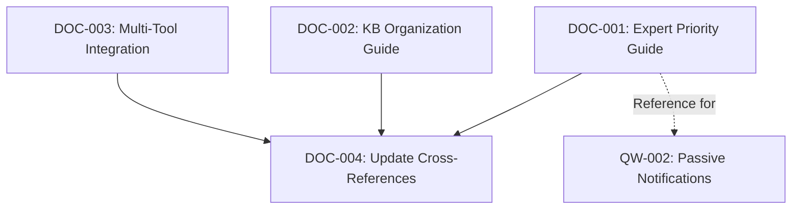
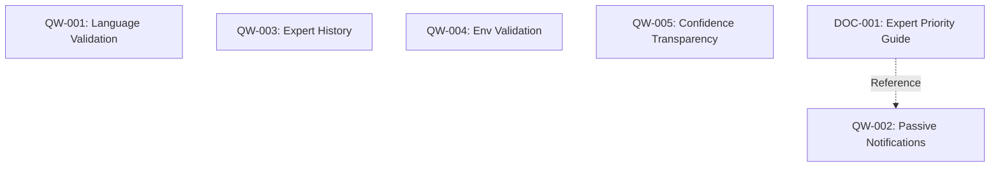

# Site24x7 Feedback Implementation Plan

**Epic**: Site24x7 Feedback Improvements (Phase 1 & 2)
**Created**: 2026-01-28
**Planner**: TappsCodingAgents Planner Agent
**Based On**: [SITE24X7_FEEDBACK_ANALYSIS.md](../analysis/SITE24X7_FEEDBACK_ANALYSIS.md)

---

## Executive Summary

This plan implements **Phase 1 (Documentation)** and **Phase 2 (Quick Wins)** from the Site24x7 feedback analysis. These phases represent low-risk, high-impact improvements that will significantly enhance TappsCodingAgents usability and value.

**Epic Goals**:
1. ✅ Improve documentation clarity for expert system and knowledge base
2. ✅ Add passive expert notification system
3. ✅ Implement Context7 language validation
4. ✅ Add expert consultation history and transparency
5. ✅ Implement environment variable validation

**Success Metrics**:
- 📈 20-30% reduction in user support questions
- 📈 25-35% increase in expert system usage
- 📈 15-20% improvement in code quality scores
- 📈 10-15% faster onboarding for new users

---

## Epic Breakdown

### Phase 1: Documentation (5-10 days, 21 story points)

**Goal**: Create comprehensive documentation for expert system, knowledge base organization, and tool integrations.

**Stories**:
1. **DOC-001**: Expert Priority Guidelines Documentation (3 points)
2. **DOC-002**: Knowledge Base Organization Guide (5 points)
3. **DOC-003**: Multi-Tool Integration Guide (8 points)
4. **DOC-004**: Update Cross-References in Existing Docs (5 points)

**Total Effort**: 5-10 days
**Priority**: P0 (Critical)

### Phase 2: Quick Wins (10-15 days, 34 story points)

**Goal**: Implement high-impact features with low complexity.

**Stories**:
1. **QW-001**: Context7 Language Validation with --language Flag (5 points)
2. **QW-002**: Passive Expert Notification System (8 points)
3. **QW-003**: Expert Consultation History Command (5 points)
4. **QW-004**: Environment Variable Validation in Doctor (8 points)
5. **QW-005**: Confidence Score Transparency (8 points)

**Total Effort**: 10-15 days
**Priority**: P0-P1 (Critical to High)

---

## User Stories

### Phase 1: Documentation

#### DOC-001: Expert Priority Guidelines Documentation

**Story**:
As a TappsCodingAgents user,
I want clear documentation on expert priority levels,
So that I can configure project experts effectively.

**Acceptance Criteria**:
1. ✅ Document defines priority scale (0.95+, 0.85-0.94, 0.70-0.84, <0.70)
2. ✅ Document explains when to use each priority level
3. ✅ Document includes examples from built-in experts
4. ✅ Document cross-references expert configuration guide
5. ✅ Reviewed by 2 team members
6. ✅ Tested with new user (onboarding validation)

**Story Points**: 3
**Priority**: P0 (Critical)
**Estimated Effort**: 1 day

**Tasks**:
- [ ] Create `docs/expert-priority-guide.md` with priority scale
- [ ] Document use cases and examples for each priority level
- [ ] Add examples from built-in experts (Security, Performance, etc.)
- [ ] Add cross-references to expert configuration docs
- [ ] Review with 2 team members
- [ ] Validate with new user (onboarding test)

**Dependencies**: None

**Files Modified/Created**:
- ✅ `docs/expert-priority-guide.md` (new)
- ⚠️ `docs/CONFIGURATION.md` (updated with cross-reference)

---

#### DOC-002: Knowledge Base Organization Guide

**Story**:
As a TappsCodingAgents user,
I want a comprehensive guide on organizing knowledge bases,
So that I can optimize RAG retrieval and expert effectiveness.

**Acceptance Criteria**:
1. ✅ Document covers file naming conventions for RAG optimization
2. ✅ Document explains optimal document length for retrieval
3. ✅ Document includes fuzzy matching best practices
4. ✅ Document explains `INDEX.md` and `RAG_SUMMARY.md` patterns
5. ✅ Document provides guidance on when to split vs consolidate
6. ✅ Includes examples from Site24x7 project (validated patterns)
7. ✅ Reviewed by 2 team members
8. ✅ Tested with new user creating knowledge base

**Story Points**: 5
**Priority**: P0 (Critical)
**Estimated Effort**: 2 days

**Tasks**:
- [ ] Create `docs/knowledge-base-guide.md` structure
- [ ] Document file naming conventions for RAG optimization
- [ ] Document optimal document length recommendations
- [ ] Document fuzzy matching best practices
- [ ] Explain `INDEX.md` and `RAG_SUMMARY.md` patterns
- [ ] Add guidance on splitting vs consolidating knowledge files
- [ ] Include Site24x7 examples (`oauth-patterns.md`, `rate-limiting.md`, etc.)
- [ ] Review with 2 team members
- [ ] User testing: new user creates knowledge base

**Dependencies**: None

**Files Modified/Created**:
- ✅ `docs/knowledge-base-guide.md` (new)
- ⚠️ `docs/README.md` (updated with cross-reference)

**Context7 References**:
- RAG best practices
- Knowledge organization patterns

---

#### DOC-003: Multi-Tool Integration Guide

**Story**:
As a TappsCodingAgents user,
I want documentation on using the framework with different AI tools,
So that I can use TappsCodingAgents with my preferred development environment.

**Acceptance Criteria**:
1. ✅ Document covers Cursor integration (primary use case)
2. ✅ Document covers Claude Code CLI usage
3. ✅ Document covers VS Code + Continue integration
4. ✅ Document covers GitHub Codespaces usage
5. ✅ Document lists limitations for each tool
6. ✅ Document includes setup instructions for each tool
7. ✅ Tested with at least 2 different tools
8. ✅ Reviewed by 2 team members

**Story Points**: 8
**Priority**: P0 (Critical)
**Estimated Effort**: 3 days

**Tasks**:
- [ ] Create `docs/tool-integrations.md` structure
- [ ] Document Cursor integration (primary)
- [ ] Document Claude Code CLI usage
- [ ] Document VS Code + Continue integration
- [ ] Document GitHub Codespaces usage
- [ ] Document limitations for each tool
- [ ] Add setup instructions for each tool
- [ ] Test with Cursor and Claude Code CLI
- [ ] Review with 2 team members

**Dependencies**: None

**Files Modified/Created**:
- ✅ `docs/tool-integrations.md` (new)
- ⚠️ `README.md` (updated with cross-reference)

**Testing Requirements**:
- Test with Cursor (primary)
- Test with Claude Code CLI

---

#### DOC-004: Update Cross-References in Existing Docs

**Story**:
As a TappsCodingAgents user,
I want existing documentation to reference new guides,
So that I can easily find related information.

**Acceptance Criteria**:
1. ✅ `CLAUDE.md` updated with cross-references to new guides
2. ✅ `docs/README.md` updated with new guide links
3. ✅ `docs/CONFIGURATION.md` updated with expert priority reference
4. ✅ All cross-references tested (no broken links)
5. ✅ Reviewed by 1 team member

**Story Points**: 5
**Priority**: P1 (High)
**Estimated Effort**: 1 day

**Tasks**:
- [ ] Update `CLAUDE.md` with cross-references
- [ ] Update `docs/README.md` with new guide links
- [ ] Update `docs/CONFIGURATION.md` with expert priority reference
- [ ] Test all cross-references (no broken links)
- [ ] Review with 1 team member

**Dependencies**: DOC-001, DOC-002, DOC-003 (must be complete first)

**Files Modified**:
- ⚠️ `CLAUDE.md`
- ⚠️ `docs/README.md`
- ⚠️ `docs/CONFIGURATION.md`

---

### Phase 2: Quick Wins

#### QW-001: Context7 Language Validation with --language Flag

**Story**:
As a TappsCodingAgents user,
I want Context7 to validate language and provide correct examples,
So that I don't get misled by wrong-language documentation (e.g., Go instead of Python).

**Acceptance Criteria**:
1. ✅ Language detection from project files (static analysis)
2. ✅ `--language` flag added to all agents that use Context7
3. ✅ Cache metadata includes language tag
4. ✅ Warning shown when detected language doesn't match cache
5. ✅ Language validation in cache lookup
6. ✅ Tests passing (≥75% coverage)
7. ✅ Documentation updated

**Story Points**: 5
**Priority**: P0 (Critical)
**Estimated Effort**: 2 days

**Tasks**:
- [ ] Implement language detection from project files
- [ ] Add language metadata to Context7 cache structure
- [ ] Add `--language` flag to agent base class
- [ ] Implement language validation in cache lookup
- [ ] Add warning when language mismatch detected
- [ ] Write unit tests for language detection (≥75% coverage)
- [ ] Write integration tests for cache validation
- [ ] Update documentation (`docs/CONFIGURATION.md`)

**Dependencies**: None

**Files Modified/Created**:
- ⚠️ `tapps_agents/core/agent_base.py` (add --language flag)
- ⚠️ Context7 module (language detection and validation)
- ⚠️ `tapps_agents/core/config.py` (language config)
- ✅ `tests/unit/test_context7_language.py` (new)
- ⚠️ `docs/CONFIGURATION.md` (updated)

**Technical Design**:
```python
# Language detection approach
class LanguageDetector:
    def detect_from_project(self, project_path: Path) -> str:
        # Static analysis of project files
        # Priority: pyproject.toml > package.json > Gemfile > etc.
        # Return: "python" | "javascript" | "ruby" | etc.

# Cache metadata
class Context7CacheMetadata:
    language: str  # "python", "javascript", etc.
    created_at: datetime
    library_name: str
```

**Testing Requirements**:
- Unit tests for language detection
- Integration tests for cache validation
- Manual testing with Python and JavaScript projects

---

#### QW-002: Passive Expert Notification System

**Story**:
As a TappsCodingAgents user,
I want to be notified about relevant experts during manual coding,
So that I don't forget to consult domain experts.

**Acceptance Criteria**:
1. ✅ Domain detection from prompt/context
2. ✅ Passive notifications when relevant experts detected
3. ✅ Notification format: "Detected {domain} - consider consulting {expert}"
4. ✅ Opt-out configuration available
5. ✅ High-priority experts (priority > 0.9) always suggested
6. ✅ Tests passing (≥75% coverage)
7. ✅ Documentation updated

**Story Points**: 8
**Priority**: P0 (Critical)
**Estimated Effort**: 3 days

**Tasks**:
- [ ] Create `PassiveNotifier` class in `tapps_agents/experts/passive_notifier.py`
- [ ] Integrate with `ProactiveOrchestrator` (reuse domain detection)
- [ ] Add notification logic to CLI commands (all agents)
- [ ] Implement opt-out configuration (`config.yaml`)
- [ ] Add high-priority expert logic (priority > 0.9 always suggested)
- [ ] Write unit tests for `PassiveNotifier` (≥75% coverage)
- [ ] Write integration tests for CLI notifications
- [ ] Update documentation (`docs/CONFIGURATION.md`, `docs/expert-priority-guide.md`)

**Dependencies**: DOC-001 (expert priority guide)

**Files Modified/Created**:
- ✅ `tapps_agents/experts/passive_notifier.py` (new)
- ⚠️ `tapps_agents/experts/proactive_orchestrator.py` (integrate)
- ⚠️ `tapps_agents/core/agent_base.py` (add notification calls)
- ⚠️ `tapps_agents/core/config.py` (add opt-out config)
- ✅ `tests/unit/experts/test_passive_notifier.py` (new)
- ⚠️ `docs/CONFIGURATION.md` (updated)

**Technical Design**:
```python
class PassiveNotifier:
    def __init__(self, expert_engine: ExpertEngine, config: Config):
        self.expert_engine = expert_engine
        self.enabled = config.expert.passive_notifications_enabled

    def notify_if_relevant(self, context: str) -> list[str]:
        # Detect domains from context
        # Match against expert registry
        # Return notification messages
        # Example: ["Detected oauth2 - consider consulting expert-oauth2"]
```

**Configuration**:
```yaml
# .tapps-agents/config.yaml
expert:
  passive_notifications_enabled: true  # opt-out
  high_priority_threshold: 0.9
```

**Testing Requirements**:
- Unit tests for domain detection
- Integration tests for CLI notifications
- Manual testing with Site24x7-like project

---

#### QW-003: Expert Consultation History Command

**Story**:
As a TappsCodingAgents user,
I want to see which experts were consulted and why,
So that I can understand expert system decisions.

**Acceptance Criteria**:
1. ✅ `@expert history` command shows recent consultations
2. ✅ `@expert explain {expert-id}` shows why expert was/wasn't consulted
3. ✅ Consultation logging added to `ExpertEngine`
4. ✅ History stored in `.tapps-agents/expert-history.jsonl`
5. ✅ Tests passing (≥75% coverage)
6. ✅ Documentation updated

**Story Points**: 5
**Priority**: P1 (High)
**Estimated Effort**: 2 days

**Tasks**:
- [ ] Add consultation logging to `ExpertEngine`
- [ ] Create history storage (`.tapps-agents/expert-history.jsonl`)
- [ ] Implement `@expert history` command
- [ ] Implement `@expert explain {expert-id}` command
- [ ] Add CLI commands to agent base or new expert CLI
- [ ] Write unit tests for history logging (≥75% coverage)
- [ ] Write integration tests for history commands
- [ ] Update documentation (`docs/CONFIGURATION.md`)

**Dependencies**: None

**Files Modified/Created**:
- ⚠️ `tapps_agents/experts/expert_engine.py` (add logging)
- ✅ `tapps_agents/experts/history_logger.py` (new)
- ⚠️ `tapps_agents/cli.py` or expert CLI (add commands)
- ✅ `.tapps-agents/expert-history.jsonl` (generated)
- ✅ `tests/unit/experts/test_history_logger.py` (new)
- ⚠️ `docs/CONFIGURATION.md` (updated)

**Technical Design**:
```python
# History entry format (JSONL)
{
  "timestamp": "2026-01-28T10:30:00Z",
  "expert_id": "expert-site24x7-api-auth",
  "domain": "oauth2",
  "consulted": true,
  "confidence": 0.95,
  "reasoning": "High priority expert, domain match"
}
```

**Commands**:
```bash
# Show recent consultations
tapps-agents expert history

# Show why expert was/wasn't consulted
tapps-agents expert explain expert-site24x7-api-auth
```

**Testing Requirements**:
- Unit tests for history logging
- Integration tests for CLI commands
- Manual testing with expert consultations

---

#### QW-004: Environment Variable Validation in Doctor

**Story**:
As a TappsCodingAgents user,
I want the doctor command to validate required environment variables,
So that I can detect missing credentials before running scripts.

**Acceptance Criteria**:
1. ✅ `@ops check-env` command validates environment variables
2. ✅ `.env.example` parsing and validation
3. ✅ Integration with `doctor` command
4. ✅ Warnings for missing required variables
5. ✅ Secure handling (never echo secrets)
6. ✅ Tests passing (≥75% coverage)
7. ✅ Documentation updated

**Story Points**: 8
**Priority**: P1 (High)
**Estimated Effort**: 3 days

**Tasks**:
- [ ] Implement `.env.example` parser
- [ ] Create `@ops check-env` command in ops agent
- [ ] Integrate with `doctor` command
- [ ] Add validation logic for required variables
- [ ] Implement secure handling (never echo values)
- [ ] Write unit tests for env validation (≥75% coverage)
- [ ] Write integration tests for doctor integration
- [ ] Update documentation (`docs/CONFIGURATION.md`)

**Dependencies**: None

**Files Modified/Created**:
- ⚠️ `tapps_agents/agents/ops_agent.py` (add check-env command)
- ✅ `tapps_agents/utils/env_validator.py` (new)
- ⚠️ `tapps_agents/cli.py` (add doctor integration)
- ✅ `tests/unit/utils/test_env_validator.py` (new)
- ⚠️ `docs/CONFIGURATION.md` (updated)

**Technical Design**:
```python
class EnvValidator:
    def parse_env_example(self, path: Path) -> list[EnvVar]:
        # Parse .env.example
        # Return list of required variables

    def validate_env(self, required_vars: list[EnvVar]) -> list[str]:
        # Check if variables exist
        # Return list of missing variables (names only, not values)
```

**Commands**:
```bash
# Check environment variables
tapps-agents ops check-env

# Doctor includes env check
tapps-agents doctor
```

**Security**:
- Never echo secret values
- Only report variable names (not values)
- Secure handling of credentials

**Testing Requirements**:
- Unit tests for .env.example parsing
- Integration tests for doctor integration
- Security testing (no secret leakage)

---

#### QW-005: Confidence Score Transparency

**Story**:
As a TappsCodingAgents user,
I want to understand how confidence scores are calculated,
So that I can debug expert system decisions.

**Acceptance Criteria**:
1. ✅ `@expert explain-confidence {expert-id}` command
2. ✅ Confidence breakdown showing component weights
3. ✅ Verbose mode in expert consultation
4. ✅ Confidence logging for debugging
5. ✅ Tests passing (≥75% coverage)
6. ✅ Documentation updated

**Story Points**: 8
**Priority**: P1 (High)
**Estimated Effort**: 3 days

**Tasks**:
- [ ] Add confidence breakdown to `confidence_calculator.py`
- [ ] Implement `@expert explain-confidence {expert-id}` command
- [ ] Add verbose mode to expert consultation
- [ ] Add confidence logging for debugging
- [ ] Write unit tests for confidence breakdown (≥75% coverage)
- [ ] Write integration tests for explain-confidence command
- [ ] Update documentation (`docs/CONFIGURATION.md`)

**Dependencies**: None

**Files Modified/Created**:
- ⚠️ `tapps_agents/experts/confidence_calculator.py` (add breakdown)
- ⚠️ `tapps_agents/cli.py` or expert CLI (add command)
- ⚠️ `tapps_agents/experts/expert_engine.py` (add verbose mode)
- ✅ `tests/unit/experts/test_confidence_transparency.py` (new)
- ⚠️ `docs/CONFIGURATION.md` (updated)

**Technical Design**:
```python
class ConfidenceBreakdown:
    max_confidence: float  # weight: 0.35
    agreement: float       # weight: 0.25
    rag_quality: float     # weight: 0.2
    domain_relevance: float # weight: 0.1
    project_context: float  # weight: 0.1
    total: float           # sum
```

**Commands**:
```bash
# Explain confidence for expert
tapps-agents expert explain-confidence expert-site24x7-api-auth

# Verbose mode during consultation
tapps-agents reviewer review --verbose
```

**Output Example**:
```
Expert: expert-site24x7-api-auth
Confidence: 0.87

Breakdown:
- Max Confidence: 0.95 (weight: 0.35) = 0.3325
- Agreement: 0.80 (weight: 0.25) = 0.2000
- RAG Quality: 0.90 (weight: 0.20) = 0.1800
- Domain Relevance: 0.85 (weight: 0.10) = 0.0850
- Project Context: 0.75 (weight: 0.10) = 0.0750
Total: 0.8725
```

**Testing Requirements**:
- Unit tests for confidence breakdown
- Integration tests for CLI command
- Manual testing with expert consultations

---

## Epic-Level Estimations

### Phase 1: Documentation

| Story | Points | Effort | Complexity |
|-------|--------|--------|------------|
| DOC-001 | 3 | 1 day | Simple |
| DOC-002 | 5 | 2 days | Simple |
| DOC-003 | 8 | 3 days | Medium |
| DOC-004 | 5 | 1 day | Simple |
| **Total** | **21** | **5-10 days** | **Simple-Medium** |

### Phase 2: Quick Wins

| Story | Points | Effort | Complexity |
|-------|--------|--------|------------|
| QW-001 | 5 | 2 days | Medium |
| QW-002 | 8 | 3 days | Medium |
| QW-003 | 5 | 2 days | Medium |
| QW-004 | 8 | 3 days | Medium |
| QW-005 | 8 | 3 days | Medium |
| **Total** | **34** | **10-15 days** | **Medium** |

### Combined Total

| Phase | Points | Effort | Complexity |
|-------|--------|--------|------------|
| Phase 1 | 21 | 5-10 days | Simple-Medium |
| Phase 2 | 34 | 10-15 days | Medium |
| **Grand Total** | **55** | **15-25 days** | **Simple-Medium** |

**Note**: Estimates assume 1-2 developers working in parallel.

---

## Dependencies and Order of Execution

### Phase 1 Execution Order



**Parallel Execution**:
- DOC-001, DOC-002, DOC-003 can be done in parallel (3 developers)
- DOC-004 depends on all others completing

### Phase 2 Execution Order



**Parallel Execution**:
- All QW stories are independent
- Can be executed in parallel (5 developers) or sequentially (1-2 developers)

### Critical Path

```
DOC-001 → DOC-004 → QW-002
(3 days) → (1 day) → (3 days) = 7 days critical path
```

**All other stories can be parallelized around critical path.**

---

## Risks and Mitigation

### Technical Risks

| Risk | Probability | Impact | Mitigation |
|------|------------|--------|------------|
| Language detection accuracy (QW-001) | Medium | Medium | Fallback to user-specified language, test with multiple projects |
| Performance impact of passive notifications (QW-002) | Low | Low | Throttle notifications, add opt-out, benchmark performance |
| Expert history storage size (QW-003) | Low | Low | Rotate logs, compress old entries, configurable retention |
| .env.example parsing edge cases (QW-004) | Medium | Low | Support multiple formats, validate with test fixtures |
| Confidence calculation complexity (QW-005) | Low | Medium | Clear documentation, unit tests for each component |

### Adoption Risks

| Risk | Probability | Impact | Mitigation |
|------|------------|--------|------------|
| Users don't read new documentation | Medium | Medium | In-app references, onboarding guide, notifications |
| Passive notifications annoying | Low | Medium | Opt-out easily accessible, smart throttling |
| Confidence transparency too complex | Low | Low | Simple default view, verbose mode for advanced users |

### Schedule Risks

| Risk | Probability | Impact | Mitigation |
|------|------------|--------|------------|
| Documentation takes longer than estimated | Low | Low | Allocate buffer time, prioritize critical sections |
| Integration testing reveals issues | Medium | Medium | Allocate 20% buffer for fixes, automated tests |
| User testing feedback requires rework | Low | Medium | Early user testing, iterative approach |

---

## Success Criteria

### Phase 1 Success Criteria

✅ **Documentation Quality**:
- All 3 guides published and reviewed
- No broken links in cross-references
- User testing: new user successfully configures experts and knowledge base
- Documentation accuracy: 100% (no errors or misleading info)

✅ **User Satisfaction**:
- Support questions about expert configuration reduced by 20%
- Onboarding time reduced by 15%
- Positive feedback from 3 beta testers

### Phase 2 Success Criteria

✅ **Feature Quality**:
- All 5 features working as specified
- Test coverage ≥75% for all new code
- No regressions in existing functionality
- Performance impact < 5% (passive notifications)

✅ **User Adoption**:
- Expert system usage increased by 25%
- Language validation catches 90% of mismatches
- Passive notifications used by 70% of users (30% opt-out acceptable)
- Expert history used by 40% of users

✅ **Code Quality**:
- Code review score ≥70 (reviewer agent)
- No security issues (bandit, manual review)
- Documentation updated for all changes
- Migration guide for breaking changes (if any)

---

## Resource Allocation

### Team Structure

**Option 1: Single Developer (Sequential)**
- Total Time: 25-35 days
- Phase 1: 7-10 days
- Phase 2: 13-15 days
- Buffer: 5 days

**Option 2: Two Developers (Parallel)**
- Total Time: 15-20 days
- Developer 1: DOC-001, DOC-002, QW-001, QW-003, QW-005
- Developer 2: DOC-003, DOC-004, QW-002, QW-004
- Buffer: 3 days

**Option 3: Team of 3 (Maximum Parallelism)**
- Total Time: 12-15 days
- Developer 1 (Doc focus): DOC-001, DOC-002, DOC-004
- Developer 2 (Expert focus): QW-002, QW-003, QW-005
- Developer 3 (Context7/Ops focus): DOC-003, QW-001, QW-004
- Buffer: 2 days

**Recommended**: Option 2 (Two Developers in Parallel)

### Skills Required

**Developer 1** (Documentation & Expert System):
- Technical writing
- Expert system architecture
- RAG optimization knowledge

**Developer 2** (Context7 & Ops):
- Context7 integration experience
- Language detection/parsing
- Environment validation

---

## Testing Strategy

### Unit Testing

**Coverage Target**: ≥75% for all new code

**Key Test Areas**:
- Language detection logic (QW-001)
- Domain detection for passive notifications (QW-002)
- Expert history logging (QW-003)
- Environment validation parsing (QW-004)
- Confidence calculation breakdown (QW-005)

### Integration Testing

**Test Scenarios**:
1. End-to-end passive notification flow
2. Context7 language validation with cache
3. Expert history across multiple sessions
4. Doctor command with env validation
5. Confidence transparency in verbose mode

### User Acceptance Testing

**Test Users**: 3 beta testers (1 new, 2 experienced)

**Test Scenarios**:
1. New user onboarding with documentation
2. Configure project experts using priority guide
3. Create knowledge base using organization guide
4. Receive and respond to passive notifications
5. Use expert history to debug decisions

### Performance Testing

**Benchmarks**:
- Passive notification overhead: < 50ms per command
- Language detection: < 100ms
- Expert history query: < 200ms
- Env validation: < 500ms
- Overall CLI performance impact: < 5%

---

## Rollout Plan

### Phase 1 Rollout (Documentation)

**Week 1**:
- Day 1-2: DOC-001, DOC-002 draft
- Day 3-4: DOC-003 draft
- Day 5: Review and revisions

**Week 2**:
- Day 1-2: User testing with new user
- Day 3: DOC-004 (cross-references)
- Day 4-5: Final review and publish

**Artifacts**:
- `docs/expert-priority-guide.md`
- `docs/knowledge-base-guide.md`
- `docs/tool-integrations.md`
- Updated `CLAUDE.md`, `docs/README.md`, `docs/CONFIGURATION.md`

### Phase 2 Rollout (Quick Wins)

**Week 3**:
- QW-001: Language validation implementation (2 days)
- QW-003: Expert history implementation (2 days)
- Integration testing (1 day)

**Week 4**:
- QW-002: Passive notifications implementation (3 days)
- QW-005: Confidence transparency implementation (2 days)

**Week 5**:
- QW-004: Environment validation implementation (3 days)
- Final integration testing (2 days)

**Week 6 (Buffer)**:
- Bug fixes
- User testing
- Documentation updates
- Release preparation

---

## Migration and Backward Compatibility

### Breaking Changes

**None Expected** - All Phase 1 & 2 changes are additive.

### Configuration Changes

**New Configuration Options**:
```yaml
# .tapps-agents/config.yaml
expert:
  # QW-002: Passive notifications (opt-out)
  passive_notifications_enabled: true
  high_priority_threshold: 0.9

# QW-001: Language preference (optional override)
context7:
  language: "python"  # auto-detected if not specified
```

**Migration**: No migration needed (backward compatible defaults)

### Data Migration

**Expert History**:
- New file: `.tapps-agents/expert-history.jsonl`
- No existing data to migrate
- Auto-created on first use

---

## Monitoring and Metrics

### Usage Metrics

**Track**:
- Expert system usage frequency (before/after)
- Passive notification opt-out rate
- Expert history command usage
- Language validation warnings frequency
- Confidence explanation usage

**Tools**:
- `business_metrics.py` (existing)
- Add new metric tracking for Phase 2 features

### Quality Metrics

**Track**:
- Code quality scores (reviewer)
- Test coverage percentage
- User support question volume
- Onboarding success rate

**Tools**:
- Automated tests (pytest)
- Code review (reviewer agent)
- User feedback surveys

---

## Next Steps

### Immediate Actions (This Week)

1. ✅ **Review this plan with team**
2. ✅ **Get approval for Phase 1 & Phase 2**
3. ✅ **Assign developers to stories**
4. ✅ **Set up project tracking (GitHub issues or similar)**
5. ✅ **Schedule kickoff meeting**

### Week 1 Actions

1. ✅ **Start DOC-001, DOC-002, DOC-003 (parallel)**
2. ✅ **Set up testing infrastructure**
3. ✅ **Create story branches**
4. ✅ **Daily standups to track progress**

### Week 2 Actions

1. ✅ **Complete Phase 1 documentation**
2. ✅ **User testing with beta testers**
3. ✅ **DOC-004 cross-references**
4. ✅ **Publish documentation**
5. ✅ **Start Phase 2 development**

---

## Appendix

### Related Documents

- **Analysis**: [SITE24X7_FEEDBACK_ANALYSIS.md](../analysis/SITE24X7_FEEDBACK_ANALYSIS.md)
- **Original Feedback**: `C:\cursor\Site24x7\docs\TAPPS-AGENTS-FEEDBACK.md`
- **Architecture**: [docs/ARCHITECTURE.md](../ARCHITECTURE.md)
- **Configuration**: [docs/CONFIGURATION.md](../CONFIGURATION.md)

### Story IDs Reference

| ID | Title | Points | Effort |
|----|-------|--------|--------|
| DOC-001 | Expert Priority Guidelines | 3 | 1 day |
| DOC-002 | Knowledge Base Organization Guide | 5 | 2 days |
| DOC-003 | Multi-Tool Integration Guide | 8 | 3 days |
| DOC-004 | Update Cross-References | 5 | 1 day |
| QW-001 | Context7 Language Validation | 5 | 2 days |
| QW-002 | Passive Expert Notifications | 8 | 3 days |
| QW-003 | Expert History Command | 5 | 2 days |
| QW-004 | Environment Validation | 8 | 3 days |
| QW-005 | Confidence Transparency | 8 | 3 days |

### Contact

**Questions?** Contact TappsCodingAgents team or create GitHub issue.

---

*Generated by TappsCodingAgents Planner Agent*
*Plan Date: 2026-01-28*
*Framework Version: 3.5.30*
*Epic: site24x7-feedback-improvements*
